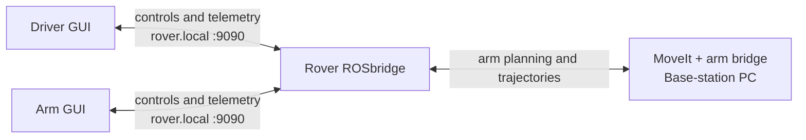
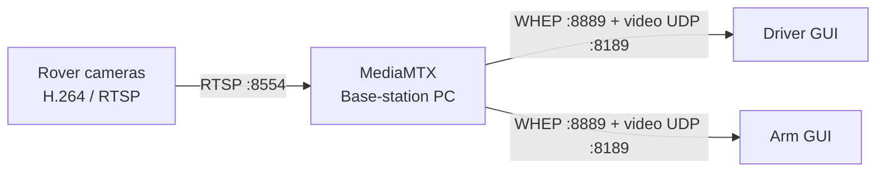

# Base station

The base station provides two independent services for rover operators:

- MoveIt 2 planning for Arm Position/IK mode.
- MediaMTX camera playback for Driver and Arm browsers.

It does not run the rover, ROSbridge, or the GUI. Start the rover (or local
mock rover) first.

## Start

For local Windows development:

```bash
docker compose -f docker-compose.local.yml up --build
```

For the production-shaped stack, enable Docker Desktop host networking on the
base-station PC (`Settings > Resources > Network > Enable host networking`),
then configure the static LAN addresses:

```bash
copy .env.example .env
# Edit .env with the rover and base-station static LAN IPs.
docker compose -f docker-compose.yml up --build
```

## Guides

- [Arm MoveIt planning](docs/arm-moveit.md) — packages, Position/IK flow,
  orientation modes, demos, and current safety boundary.
- [Media gateway](docs/media-gateway.md) — rover RTSP input, browser playback,
  ports, and MediaMTX configuration.
- [Networking](docs/networking.md) — local mock setup, rover LAN setup, names,
  and Command-team configuration.

## Operator and rover connections

### Controls and arm planning



### Camera video



The Driver and Arm GUIs connect directly to the rover for controls and
telemetry. MediaMTX only provides camera playback, while MoveIt handles Arm
Position/IK planning. The Arm GUI normally runs on the base-station PC, but it
can run elsewhere when it can resolve the same rover and base-station names.
