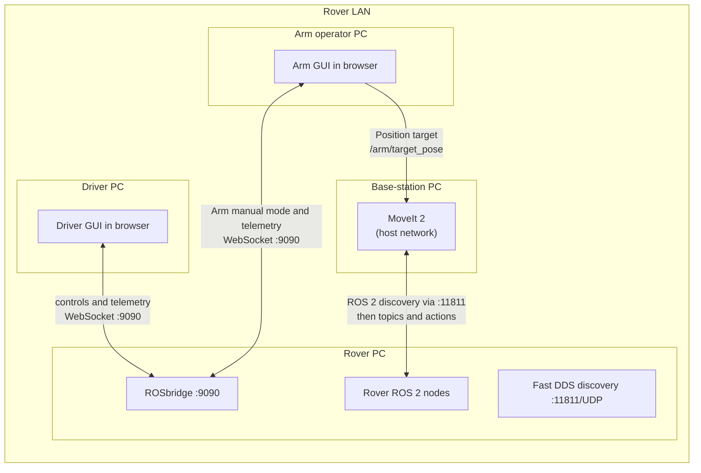
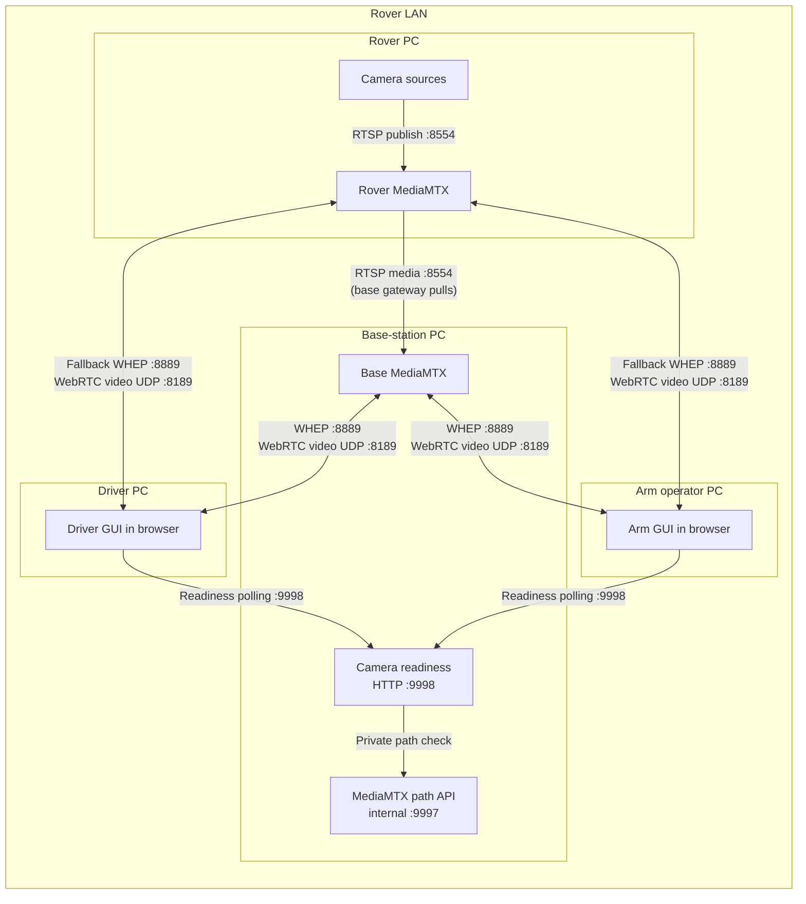

# Networking

## Real rover network at a glance

The rover, base station, Driver PC, and Arm operator PC connect to the same
private LAN, which can be a switch or the rover radio network. Internet access
is not required.

### ROS controls and arm planning



The Driver and Arm GUIs connect to the rover for controls and telemetry.
MoveIt exchanges planning and trajectory data with the rover over ROS 2.

### Camera video



Camera video is published once to rover MediaMTX, pulled by the base-station
gateway, and normally served from there to operator browsers. If that gateway
is down, eligible GUI tiles can play directly from rover MediaMTX. The
readiness endpoint only checks the base gateway's paths; it does not open a
video session. Camera traffic does not pass through MoveIt.

## Local mock setup

On Windows, enable Docker Desktop host networking in
`Settings > Resources > Network > Enable host networking` (Docker Desktop 4.34
or newer). Create the shared local camera network once:

```bash
docker network create chasmata-local-media
```

Then start the mock rover and base-station stacks in either order:

```bash
cd test/mock_rover
docker compose up --build
```

Then start the local base station:

```bash
cd basestation
docker compose -f docker-compose.local.yml up --build
```

The mock rover runs ROSbridge at `ws://localhost:9090` and the Fast DDS
discovery server on UDP `11811`. Its ROS services and local MoveIt use host
networking and connect through `127.0.0.1:11811`; they do not use the shared
camera network. Only the rover and base-station MediaMTX gateways share
`chasmata-local-media`; the base gateway pulls the mock feeds from
`rover-media-gateway:8554`. Rover MediaMTX also exposes local fallback playback
on WHEP `8890` and ICE UDP `8190`.

## Real rover LAN

On the base-station PC, copy `.env.example` to `.env`, set the static IP
values, and start the normal stack:

```bash
copy .env.example .env
docker compose -f docker-compose.yml up --build
```

| Variable                              | What it tells                                                                     | Example                 |
| ------------------------------------- | --------------------------------------------------------------------------------- | ----------------------- |
| `ROVER_DISCOVERY_SERVER`              | MoveIt where to find the rover's ROS discovery service.                           | `192.168.1.20:11811`    |
| `ROVER_RTSP_HOST` / `ROVER_RTSP_PORT` | Base MediaMTX where to pull the rover video paths; use its static IP from Docker. | `192.168.1.20` / `8554` |
| `MEDIA_WEBRTC_ADDITIONAL_HOSTS`       | Base MediaMTX which base-station LAN IP to give camera viewers.                   | `192.168.1.10`          |
| `MEDIA_WEBRTC_ALLOW_ORIGINS`          | Which browser page origins may request WHEP playback.                             | `http://localhost:4200` |

The discovery value is for MoveIt to find the rover's ROS graph. The RTSP
address tells base MediaMTX where to pull the camera sources. The WebRTC host
value tells browsers where to send and receive video UDP. None of these values
configures the Driver or Arm GUI's direct ROS connection.

## Names used by GUIs

Operator PCs use names instead of numeric addresses:

| Name                | Used for                                                            |
| ------------------- | ------------------------------------------------------------------- |
| `rover.local`       | ROSbridge and rover controls/telemetry, such as `rover.local:9090`. |
| `basestation.local` | Camera gateway, such as `http://basestation.local:8889`.            |

Windows resolves these names through the rover network's DNS or hosts-file
configuration. The Driver GUI and Arm GUI use the same names.

## Responsibility boundary

Command owns the real network setup: static rover and base-station IPs, name
resolution for `rover.local` and `basestation.local`, and firewall/radio rules
for ROS discovery, rover RTSP `8554`, both gateways' WHEP `8889` and ICE UDP
`8189`, and the base camera-readiness endpoint `9998`.

This repository supplies the service configuration that consumes those values.
It does not assign IPs, create DNS records, or configure the radio network.
