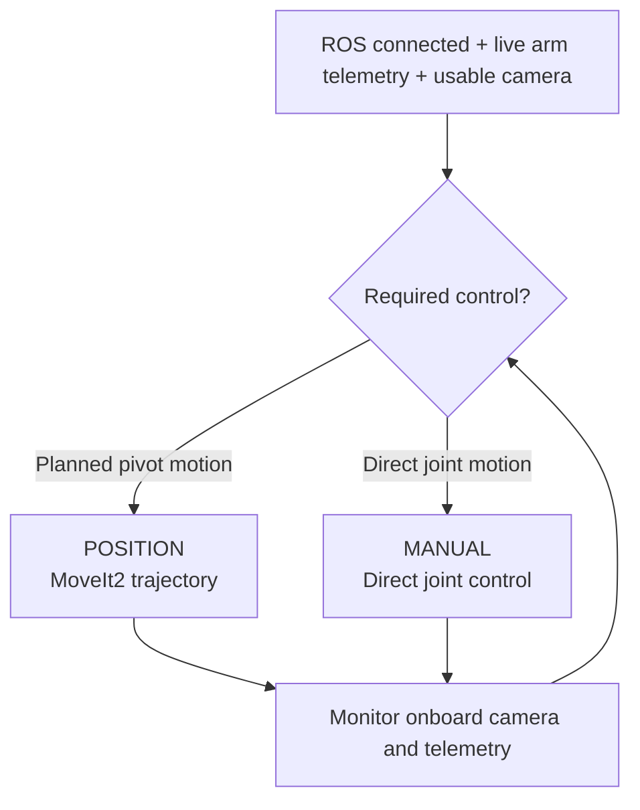
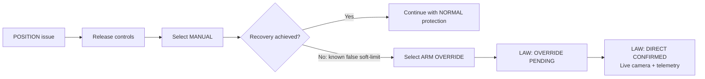
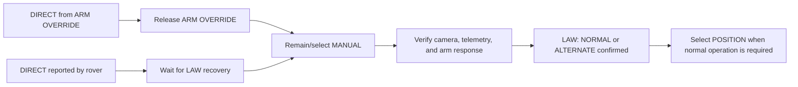
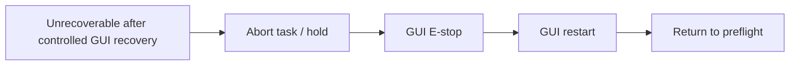

# Rover Operations SOP

> **v0.1 — GUI-only basestation/mock-rover procedures.** These procedures use
> only GUI-provided camera, telemetry, control, and restart functions. Physical
> hardware behavior and physical E-stop procedure are not yet validated.

This SOP describes normal operation and recovery philosophy. The companion
[Quick Reference Handbook](qrh.md) is the short-form operator checklist.

Operate the rover through its onboard camera feeds and live telemetry. If either
does not provide enough confidence to continue controlled recovery, stop the
task or use GUI E-stop; do not seek field-side assistance during a run.

## CONFIG / PREFLIGHT

Future content.

## DRIVE

Future content.

## ARM

### Normal operating principle

Use Position mode for planned arm movement. Position mode sends the requested
J4-pivot target to MoveIt2; MoveIt2 plans and sends a trajectory, while rover
telemetry remains the source of truth for actual arm position.

Use Manual mode when direct joint control is required. It is the normal
recovery step when Position/MoveIt2 cannot produce the required result.

Before moving the arm, confirm the ROS link is connected, arm telemetry is
live, onboard camera coverage is usable, and the intended motion can be
monitored from the GUI.
Use the GUI control scheme for the current gamepad mapping; this SOP does not
duplicate those labels.



### Position mode

- Use Position for normal, solver-assisted movement.
- Observe the onboard camera, green actual marker, and telemetry; do not rely
  on the commanded target alone.
- In `LOCKED`, MoveIt2 retains the captured end-effector orientation and plans
  all six joints. In `UNLOCKED`, MoveIt2 plans J1–J3 while Arm Ops controls the
  wrist joints directly.
- A stale, missing, or invalid telemetry state is not a condition for continued
  Position operation. Release controls and use the recovery flow.

### Manual mode

- Manual mode commands individual joints directly and is the primary fallback
  from Position mode.
- Make deliberate, small movements while monitoring onboard camera and
  telemetry.
- Manual mode does not itself call for Arm Override; use normal protection
  unless a known false-protection condition requires otherwise.

### Arm protection law

`NORMAL`, `ALTERNATE`, and `DIRECT` are rover-reported LAW states; Arm Ops does
not select a LAW state. `NORMAL` is the standard condition. `ALTERNATE`
indicates that GUI-side protection is unavailable while rover-side soft-limit
protection remains active. `DIRECT` means neither soft-protection layer can be
relied on, because protection has been bypassed or has become unavailable.

`DIRECT` has two entry paths. For a known false soft-limit, Arm Ops selects
Arm Override and waits for LAW confirmation. If GUI-side and rover-side
protection both become unavailable, the rover may report `DIRECT`
automatically.

Default recovery escalation is:



The rover can also report `DIRECT` automatically when both protection layers
are unavailable. In either entry path, use Manual mode with reliable onboard
camera and live telemetry, and make only small, deliberate inputs.

`POSITION + DIRECT` is permitted only for a known false-protection condition,
with reliable onboard camera and live telemetry evidence. It is not the default
response to unexpected motion, stale telemetry, or a suspected planning fault.
Those conditions require controls released and Manual recovery first; if the
GUI cannot support controlled recovery, abort the task or use GUI E-stop.

### Return to normal operation

When Override caused `DIRECT`, release Override before returning to Position
control. For automatically reported `DIRECT`, wait for rover LAW telemetry to
recover to `NORMAL` or `ALTERNATE`:



Do not return to Position until ROS, telemetry, and camera coverage are live,
and the actual arm state is understood.

## CAMERA / GIMBAL

Future content.

## SYSTEM / LINK

Future content.

## POWER

Future content.

## RECOVERY / EMERGENCY

### GUI E-stop and restart

GUI E-stop is the final immediate action for unexpected motion or a state that
cannot be recovered safely through GUI controls. It remotely halts the rover
control stack; it is not a physical power cut and is not released to resume
operation.



```text
CONTROLS ............................ RELEASE
GUI E-STOP .......................... PRESS
ROVER STATE ......................... HALTED
GUI ACTION .......................... RESTART ROVER
ROS LINK / CAMERA / TELEMETRY ....... RECONNECT AND VERIFY
OPERATIONS .......................... RETURN TO PREFLIGHT
```

Physical intervention or outside radio support is an ultimate final option,
only after the run is ended or competition procedure permits it. Physical
E-stop procedure remains pending hardware validation.
