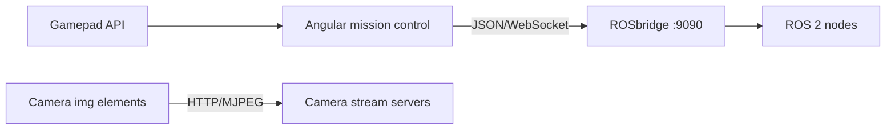

# 🖥️ Deakin Rover GUI

The browser-based mission-control interface for the Deakin Competitive Robotics Club rover.

This project is an Angular replacement for the previous Next.js GUI. The migration will preserve the rover's existing ROS topics, services, gamepad mappings, and camera interfaces while introducing a more structured and maintainable frontend architecture.

> This project is currently in its migration stage. The existing Next.js GUI remains the working reference until this application reaches feature parity and passes rover testing.

## 🧰 Technology stack

- Angular 22 with standalone components
- TypeScript
- Angular Material and SCSS
- RxJS for asynchronous state and telemetry streams
- ROSLIB.js for browser-to-ROS communication
- ROSbridge using JSON over WebSocket
- Browser Gamepad API for operator controls
- HTTP MJPEG camera streams
- Vitest for unit testing

## 🎨 Design language

The mission-control interface is inspired by the Airbus glass cockpit philosophy: a calm symbolic overview during normal operation and consistent colour semantics for operational state.

*Some design decisions have a longer history than this rover :)*
<!-- From Tom to future you: If you found the easter eggs, you probably know where the Airbus obsession came from. :))) -->

## 📚 Documentation

- [Colour palette](docs/color-palette.md) — the UI colour system and operational status semantics.
- [Operator layouts](docs/operator-layouts.md) — the Driver and Arm dashboard layouts and responsibilities.
- [Functional Mode Annunciator](docs/fma.md) — confirmed DRIVE, ARM, LAW, SYSTEM, and LINK states.
- [Electronic Centralized Advisory Monitor (ECAM) and System Display (SD)](docs/ecam-and-system-display.md) — alert behaviour, operator procedures, shared alert architecture, and subsystem display pages.
- [ECAM Code Dictionary](docs/ecam-code-dictionary.md) — stable alert codes, severities, display text, and meanings.
- [Telemetry requirements](docs/telemetry-requirements.md) — FMA, ECAM, and System Display (SD) telemetry, update rates, and recovery behaviour.
- [Arm inverse kinematics](docs/arm-ik.md) — URDF model, browser-side IK solver, and the future joint-angle command handoff.
- [Mock rover](../test/mock_rover/README.md) — ROS 2 feedback simulator for GUI integration testing.

## 🖥️ Current Angular implementation

### Functional Mode Annunciator


### Driver dashboard


### Arm operator dashboard


### ECAM and System Display (SD)


## 🧭 System overview



The GUI communicates directly with the rover on its private operator network:

- Controls and telemetry use ROSLIB through ROSbridge.
- Camera video uses separate HTTP MJPEG streams.
- Driver control publishes `sensor_msgs/Joy` on `/joy`.
- Arm control publishes remapped `sensor_msgs/Joy` on `/arm/joy`.
- Driver and Arm Operator GUIs may both view and control the shared Gimbal camera.
  Gimbal ownership is requested through the controller's **GIMBAL PRIORITY**
  button and confirmed authoritatively by the rover.
- The physical rover, radio link, controller, and safety behaviour must be tested before the Angular GUI replaces the existing interface.

## 📋 Prerequisites

- Node.js compatible with the Angular version in `package.json`
- npm
- Docker Desktop and the rover Dev Container when testing ROS integration locally

The Angular CLI does not need to be installed globally. Commands can be run through the npm scripts or with `npx ng`.

## ▶️ Install and run

Install dependencies:

```bash
npm install
```

Start the Angular development server:

```bash
npm start
```

Open <http://localhost:4200>.

## 🔌 Local ROS testing

Start ROSbridge from the `deakin_rover` base-station Dev Container:

```bash
source install/setup.bash
ros2 launch rosbridge_server rosbridge_websocket_launch.xml
```

Use this endpoint from the Angular GUI:

```text
ws://rover.local:9090
```

Only ROSbridge is required for initial connection testing. The full rover bring-up starts hardware-dependent nodes and is not required for ordinary GUI development.

Current legacy rover camera defaults (reference only):

```text
Front camera: http://dcr-rover.local:8080/?action=stream
Rear camera:  http://dcr-rover.local:8090/?action=stream
Arm camera:   http://dcr-rover.local:8091/?action=stream
```

These endpoints support the existing rover code. The current proposed new camera
inventory is Front, Arm, and a controllable downward-facing Gimbal camera that
provides a top-like/bird's-eye view. The final hardware and stream interfaces
remain under development and will be updated once finalised.

## 🏗️ Architecture

The application uses a lightweight feature-based structure:

```text
src/app/
├── core/
│   ├── control/                 # Global control mode plus Driver and Arm publishers
│   ├── ecam/                    # Application-wide ECAM alert state and messages
│   ├── fma/                     # Functional Mode Annunciator state
│   ├── gamepad/                 # Browser gamepad polling and mapping
│   └── ros/                     # ROS connection, topics, and shared models
│
├── features/
│   ├── cameras/
│   │   ├── bird-view/           # Shared controllable Gimbal/bird's-eye view
│   │   └── camera-stream/       # Individual resilient stream viewer
│   ├── connection/              # Rover connection controls and status
│   ├── gamepad/                 # Gamepad controls and feedback
│   └── telemetry/               # Rover and subsystem schematics
│
├── layout/
│   ├── ecam-panel/              # ECAM alert and System Display panels
│   ├── mission-control/         # Shared shell, navigation, header, and FMA
│   ├── driver/                  # Driver dashboard and panel arrangement
│   └── arm/                     # Arm dashboard and panel arrangement
│
└── shared/
    ├── action-button/           # Reusable action button
    ├── confirmation-dialog/     # Reusable confirmation UI
    ├── control-flow-connector/  # Control-flow visual connector
    ├── control-switch/          # Reusable control-mode switch
    └── status-indicator/        # Reusable state indicator
```

### Responsibility rules

- `core` owns application-wide singleton infrastructure and safety-critical state.
- `features` owns complete operator capabilities and their feature-specific UI.
- `shared` contains small reusable presentation components.
- `layout` arranges feature components but does not communicate with ROS directly.
- Operator dashboards own their own viewport layout; `MissionControl` remains a shell.
- Components should not create independent ROS connections.
- ROS and gamepad logic should remain outside presentation-only components.

## 🛠️ Development commands

```bash
# Start the development server
npm start

# Create a production build
npm run build

# Run unit tests
npm test -- --watch=false

# Generate Angular code using the project-local CLI
npx ng generate component features/example/example-panel
npx ng generate service core/example/example
```

## 🕰️ Existing GUI reference

During migration, use the existing implementation in the sibling rover repository as a behavioural reference:

```text
../deakin_rover/dcr_base_station/gui
```

Do not remove or replace the existing GUI until the Angular application reaches feature parity and completes rover integration testing.
