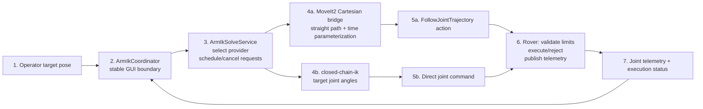

# Arm position and inverse kinematics

This document describes the provider-independent arm position workflow in the
Angular GUI. It converts an Arm Operator target into either a local joint
command or a remote MoveIt2 trajectory request. The coordinator keeps the GUI
contract stable whether the provider is `closed-chain-ik` or MoveIt2. It does
**not** replace rover-side safety checks.

In Position mode, the gamepad updates the target through
`ArmPositionControl`; in Manual mode, `ArmManualControl` continues to publish
the existing `/arm/joy` command. `ArmControlModeService` selects which handler
receives input, and Arm Ops can switch modes while master control is active.

## Responsibility boundary



MoveIt2 is the current default. The GUI sends only the target pose to
`/arm/target_pose`. The MoveIt2 bridge generates one complete, time-stamped
`FollowJointTrajectory` goal and sends it to the rover. The GUI does not
schedule trajectory points, publish them, or execute them. The rover remains
authoritative for limits, acceptance, execution, and actual joint state.

`closed-chain-ik` remains selectable as the fast MVP fallback. It returns named
joint angles to the existing direct-command path. Switching providers does not
change the operator controls, model viewer, or coordinator boundary.

## Model source of truth

The current arm model is:

[`public/assets/kinematics/arm.urdf`](../public/assets/kinematics/arm.urdf)

It is the existing six-joint arm reused for the current rover cycle. The URDF
defines the chain geometry, joint axes, joint limits, and end-effector location
used by the GUI and MoveIt2 test stack.

The current movable joints are, in URDF order:

1. `base_joint`
2. `shoulder_joint`
3. `elbow_joint`
4. `yaw_joint`
5. `pitch_joint`
6. `roll_joint`

The terminal link is `ee_link`. All joint angles and limits are in **radians**.
When the mechanical design changes, update the URDF first so its joint names,
origins, axes, limits, and `ee_link` match the physical arm.

## GUI implementation

[`src/app/core/arm/ik/arm-ik-coordinator.ts`](../src/app/core/arm/ik/arm-ik-coordinator.ts)
is the Angular singleton that owns the GUI-facing workflow. It stores and
validates the target position, requests execution when the target changes, and
exposes GUI status plus the latest telemetry-backed joint angles. The
`ArmModelViewer` renders the URDF, target marker, telemetry, and execution
status.

The provider contract is defined alongside the coordinator.
[`src/app/core/arm/ik/arm-ik-solve.service.ts`](../src/app/core/arm/ik/arm-ik-solve.service.ts)
owns provider selection, URDF loading, latest-request scheduling, and stale
request cancellation.

[`src/app/core/arm/ik/providers/arm-closed-chain-ik-provider.ts`](../src/app/core/arm/ik/providers/arm-closed-chain-ik-provider.ts)
implements the local `closed-chain-ik` calculation.
[`src/app/core/arm/ik/providers/arm-moveit-ik-provider.ts`](../src/app/core/arm/ik/providers/arm-moveit-ik-provider.ts)
adapts the remote MoveIt2 target and execution-status topics to the same
provider contract. A successful MoveIt2 result means the rover accepted and
completed the trajectory; actual joint angles still come from rover telemetry.

The MoveIt2 status topic is `/arm/moveit/status`. It reports `PLANNING`,
`EXECUTING`, `SUCCEEDED`, `CANCELED`, or `FAILED`, with the request ID and an
optional message. A new target cancels the active trajectory and causes the
bridge to replan from the latest rover joint state.

The provider-independent API is:

```ts
const initialPose = await armIkSolveService.load();
const result = await armIkSolveService.solve({
  position: [x, y, z],
  orientation: [qx, qy, qz, qw],
});

// MoveIt2: the target was planned and executed; jointAngles is empty.
// closed-chain-ik: result.jointAngles contains the direct command.
// A superseded target resolves as null.
```

The target position uses the same coordinate frame as the initial pose returned
by `ArmIkSolveService.load()`. The current Position mode keeps the loaded
end-effector orientation while changing the XYZ target.

## Current and future work

Implemented now:

- Loading the current URDF and reading its joint limits.
- Selecting between `closed-chain-ik` and MoveIt2 through one coordinator.
- Generating a straight, fixed-orientation Cartesian path in MoveIt2.
- Time-parameterizing one complete `JointTrajectory` with MoveIt2.
- Sending the trajectory through `FollowJointTrajectory`.
- Canceling an active MoveIt2 trajectory when a newer target arrives.
- Reporting MoveIt2 planning and execution status to the GUI.
- Updating the target from Position-mode gamepad controls.
- Rendering the target marker and applying rover-reported joint telemetry to
  the Three.js arm.
- Enforcing the final joint-limit decision on the rover.

Not enabled yet:

- Collision checking and obstacle-aware motion planning.
- OMPL/global planning for a later collision-aware mode.
- An optional trajectory preview in the GUI. The GUI must remain a status and
  telemetry display, not the trajectory executor.
