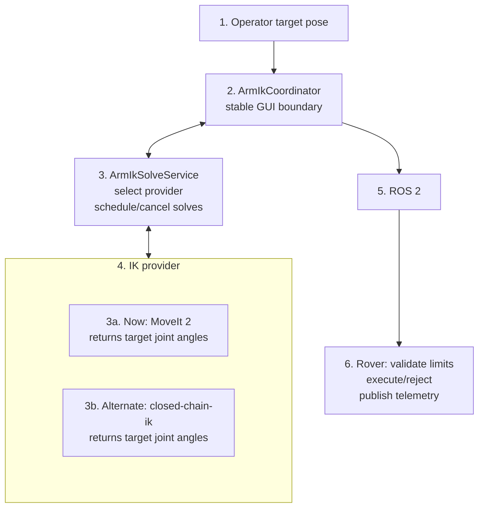

# Arm inverse kinematics (IK)

This document describes the provider-independent arm IK workflow in the Angular
GUI. It converts an Arm Operator position target into named joint angles using
the selected IK provider. The coordinator keeps the GUI contract stable whether
the provider is `closed-chain-ik` or MoveIt 2. It does **not** replace rover-side
safety checks.

In Position mode, the gamepad updates the target through
`ArmPositionControl`; in Manual mode, `ArmManualControl` continues to publish
the existing `/arm/joy` command. `ArmControlModeService` selects which handler
receives input. It owns the shared input loop, so Arm Ops can switch between
handlers while the master control remains active.

## Responsibility boundary



`ArmIkCoordinator` is the stable boundary between the GUI and the selected IK
provider. The current provider is MoveIt 2; `closed-chain-ik` remains selectable
without changing the operator controls, model viewer, or rover command
boundary. The rover remains the authoritative source of whether a command is
accepted and what the arm actually did.

The IK math can run without ROS, which is useful for unit tests. The dashboard
runtime waits for a ROS connection before starting the Arm IK workflow because
an operational solve needs live arm context and a future command path.

## Model source of truth

The current arm model is:

[`public/assets/kinematics/arm.urdf`](../public/assets/kinematics/arm.urdf)

It is the existing six-joint arm reused for the current rover cycle. The URDF
defines the chain geometry, joint axes, joint limits, and the end-effector
location used by the GUI solver.

The current movable joints are, in URDF order:

1. `base_joint`
2. `shoulder_joint`
3. `elbow_joint`
4. `yaw_joint`
5. `pitch_joint`
6. `roll_joint`

The solver expects the terminal link to be named `ee_link`. All joint angles
and limits are in **radians**.

When the mechanical design changes, update the URDF first. Its joint names,
origins, axes, limits, and `ee_link` must match the physical arm. The current
wrapper deliberately requires six movable revolute/continuous joints; changing
the final arm to a different degree of freedom count requires a small wrapper
update as well.

## GUI implementation

[`src/app/core/arm/ik/providers/arm-closed-chain-ik-provider.ts`](../src/app/core/arm/ik/providers/arm-closed-chain-ik-provider.ts)
is the local provider for the calculation engine built on:

- `urdf-loader` to parse the URDF.
- `closed-chain-ik` to solve the kinematic chain.

[`src/app/core/arm/ik/arm-ik-coordinator.ts`](../src/app/core/arm/ik/arm-ik-coordinator.ts)
is the Angular singleton that owns the dashboard workflow. It stores and
validates the target position, requests solves when the target changes, and
exposes the status and latest valid joint angles. The
`ArmModelViewer` consumes those outputs and only renders the URDF, target
marker, and valid joint angles.

The `ArmIkProvider` contract is defined alongside the coordinator.
`ArmClosedChainIkProvider` implements the local `closed-chain-ik` provider, while
[`src/app/core/arm/ik/providers/arm-moveit-ik-provider.ts`](../src/app/core/arm/ik/providers/arm-moveit-ik-provider.ts)
adapts the remote MoveIt2 request/solution topics to the same result shape.
[`src/app/core/arm/ik/arm-ik-solve.service.ts`](../src/app/core/arm/ik/arm-ik-solve.service.ts)
loads the model, selects between those providers, schedules the latest target,
handles stale asynchronous results, and keeps provider-specific execution
details out of the coordinator.

On the first successful model load, the coordinator initializes the blue target
marker from the URDF model's current end-effector pose. Later reloads preserve
the operator's target.

[`src/app/core/control/arm/arm-position-control.ts`](../src/app/core/control/arm/arm-position-control.ts)
is the Position-mode gamepad adapter. It converts left-stick X/Y input into
horizontal target movement and D-pad up/down input into height movement, then
passes the resulting target delta to `ArmIkCoordinator`. It does not publish
joint commands to ROS.

The provider-independent solve flow is:

```ts
const initialPose = await armIkSolveService.load();
const result = await armIkSolveService.solve({
  position: [x, y, z],
  orientation: [qx, qy, qz, qw],
});

// result.status: converged | stalled | diverged | timeout
// result.jointAngles: { base_joint: ..., shoulder_joint: ..., ... }
// a superseded target resolves as null
```

For the current coordinator workflow, the position comes from its shared
target. The coordinator keeps the orientation from the loaded arm pose while
Position mode moves the XYZ target, then delegates the solve to
`ArmIkSolveService`.
The target position must use the same coordinate frame as the initial pose
returned by `ArmIkSolveService.load()`. Do not mix a camera frame, map frame,
or another visualisation frame into the solver without a defined transform.

The GUI should use the latest measured arm telemetry as the solve seed where
available. That produces a solution close to the physical arm's present pose
and reduces unexpected motion between otherwise valid IK solutions.

## Current and future work

Implemented now:

- Loading the current URDF.
- Reading movable joint names and URDF limits.
- Solving a full end-effector pose.
- Returning named joint angles and a solver status.
- Selecting between `closed-chain-ik` and MoveIt 2 through one coordinator.
- Storing and validating the Arm Position-mode target position.
- Updating the target from the Position-mode gamepad controls.
- Coordinating target changes through `ArmIkCoordinator`.
- Showing `SOLVING`, `VALID`, `UNREACHABLE`, and `INVALID` states.
- Rendering the target marker and applying rover-reported joint telemetry to
  the Three.js arm.

Not implemented yet:

- Live joint telemetry as the normal IK seed for the next IK solve.
- Planner status and rejection details from the MoveIt2 bridge.
- Rover acknowledgement/rejection display.
- Collision checking and motion-path planning.

The hardware and control teams must agree on the eventual command and telemetry
messages. The GUI should only publish a solution when the solver reports a
usable result; the rover must still independently reject unsafe or invalid
angles.
