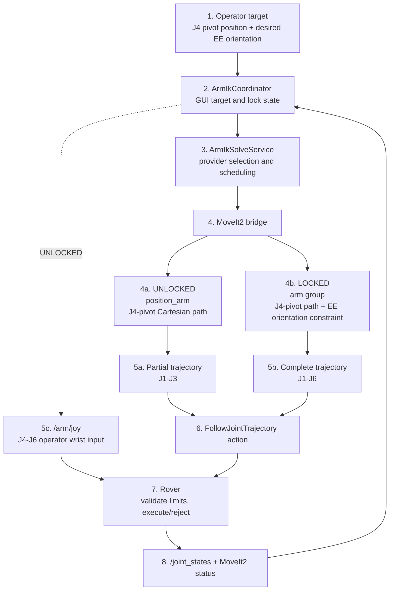

# Arm position and inverse kinematics

This document describes the provider-independent arm position workflow in the
Angular GUI. It converts an Arm Operator target into either a local joint
command or a remote MoveIt2 trajectory request. For MoveIt2, the target
position is the J4 wrist pivot, while the orientation belongs to `ee_link`.
The coordinator keeps the GUI contract stable whether the provider is
`closed-chain-ik` or MoveIt2. It does **not** replace rover-side safety checks.

In Position mode, the gamepad updates the target through
`ArmPositionControl`; in Manual mode, `ArmManualControl` continues to publish
the existing `/arm/joy` command. `ArmControlModeService` selects which handler
receives input, and Arm Ops can switch modes while master control is active.

## Responsibility boundary



MoveIt2 is the current default. The GUI sends the target pose to
`/arm/target_pose` and the local lock state to `/arm/orientation_lock`. The
MoveIt2 bridge generates one time-stamped `FollowJointTrajectory` goal and
sends it to the rover. The GUI does not schedule trajectory points, publish
them, or execute them. The rover remains authoritative for limits, acceptance,
execution, and actual joint state.

In UNLOCKED mode, MoveIt2 uses position-only IK and plans only J1-J3 to move `j4_pivot_link`. The GUI
sends the operator's J4-J6 wrist input through the existing `/arm/joy` topic.
In LOCKED mode, MoveIt2 plans all six joints and constrains `ee_link` to the
requested orientation while the J4 pivot follows a straight path. Entering
LOCKED captures the orientation from actual rover telemetry; leaving it
returns J4-J6 to the operator without a local command jump.

`closed-chain-ik` remains selectable as the fast MVP fallback. It returns named
joint angles to the existing direct-command path. Switching providers does not
change the operator controls, model viewer, or coordinator boundary.

## Model source of truth

The current arm model is:

[`public/assets/kinematics/arm.urdf`](../public/assets/kinematics/arm.urdf)

It is the existing six-joint arm reused for the current rover cycle. The URDF
defines the chain geometry, joint axes, joint limits, and end-effector location
used by the GUI and MoveIt2 test stack.

The dedicated J4 pivot frame is `j4_pivot_link`, located at the `yaw_joint`
origin. The current movable joints are, in URDF order:

1. `base_joint`
2. `shoulder_joint`
3. `elbow_joint`
4. `yaw_joint`
5. `pitch_joint`
6. `roll_joint`

The terminal link is `ee_link`; it is the orientation-constrained link in
LOCKED mode. All joint angles and limits are in **radians**.
When the mechanical design changes, update the URDF first so its joint names,
origins, axes, limits, and `ee_link` match the physical arm.

## GUI implementation

[`src/app/core/arm/ik/arm-ik-coordinator.ts`](../src/app/core/arm/ik/arm-ik-coordinator.ts)
is the Angular singleton that owns the GUI-facing workflow. It stores and
validates the J4-pivot target, desired EE orientation, and local orientation
mode. It requests execution when those values change and exposes GUI status
plus the latest telemetry-backed joint angles. The `ArmModelViewer` renders
the URDF, J4-pivot markers, telemetry, and execution status.

The provider contract is defined alongside the coordinator.
[`src/app/core/arm/ik/arm-ik-solve.service.ts`](../src/app/core/arm/ik/arm-ik-solve.service.ts)
owns provider selection, URDF loading, latest-request scheduling, and stale
request cancellation.

[`src/app/core/arm/ik/providers/arm-closed-chain-ik-provider.ts`](../src/app/core/arm/ik/providers/arm-closed-chain-ik-provider.ts)
implements the local `closed-chain-ik` calculation.
[`src/app/core/arm/ik/providers/arm-moveit-ik-provider.ts`](../src/app/core/arm/ik/providers/arm-moveit-ik-provider.ts)
adapts the remote MoveIt2 target and execution-status topics to the same
provider contract. A successful MoveIt2 result means the rover accepted and
completed the trajectory; actual joint angles still come from rover telemetry.

The MoveIt2 status topic is `/arm/moveit/status`. It reports `PLANNING`,
`EXECUTING`, `SUCCEEDED`, `CANCELED`, or `FAILED`, with the request ID and an
optional message. A new target cancels the active trajectory and causes the
bridge to replan from the latest rover joint state.

The provider-independent API is:

```ts
const initialPose = await armIkSolveService.load();
const result = await armIkSolveService.solve({
  position: [x, y, z],
  orientation: [qx, qy, qz, qw],
  orientationMode: 'unlocked',
});

// MoveIt2: the target was planned and executed; jointAngles is empty.
// closed-chain-ik: result.jointAngles contains the direct command.
// A superseded target resolves as null.
```

For MoveIt2, `position` is a `j4_pivot_link` target in `base_link`, and
`orientation` is the desired `ee_link` orientation. `orientationMode` selects
the partial J1-J3 path (`unlocked`) or the complete orientation-constrained
path (`locked`). `ArmIkSolveService.load()` returns the initial pose in the
selected provider's target frame. The MoveIt2 provider also publishes the lock
state on `/arm/orientation_lock` before publishing each target.

## Current and future work

Implemented now:

- Loading the current URDF and reading its joint limits.
- Selecting between `closed-chain-ik` and MoveIt2 through one coordinator.
- Generating a straight J4-pivot Cartesian path in MoveIt2.
- Planning an UNLOCKED partial J1-J3 trajectory.
- Planning a LOCKED complete J1-J6 trajectory with an `ee_link` orientation
  constraint.
- Time-parameterizing the selected `JointTrajectory` with MoveIt2.
- Sending the trajectory through `FollowJointTrajectory`.
- Canceling an active MoveIt2 trajectory when a newer target arrives.
- Reporting MoveIt2 planning and execution status to the GUI.
- Updating the target and orientation from Position-mode gamepad controls.
- Sending UNLOCKED wrist input through `/arm/joy`.
- Rendering the J4-pivot target marker and applying rover-reported joint
  telemetry to the Three.js arm.
- Enforcing the final joint-limit decision on the rover.

Not enabled yet:

- Collision checking and obstacle-aware motion planning.
- OMPL/global planning for a later collision-aware mode.
- An optional trajectory preview in the GUI. The GUI must remain a status and
  telemetry display, not the trajectory executor.
