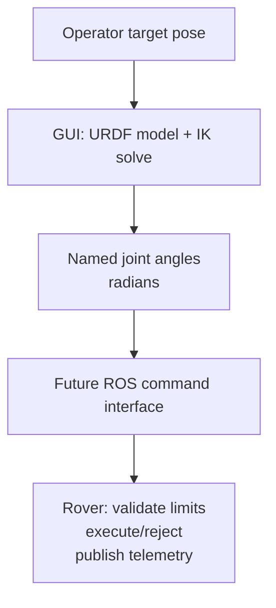

# Arm inverse kinematics (IK)

This document describes the browser-side arm IK workflow in the Angular GUI.
It converts an Arm Operator position target, with the current fixed orientation,
into named joint angles. It does **not** drive motors or replace rover-side
safety checks.

## Responsibility boundary



The GUI owns the kinematic calculation. The rover remains the authoritative
source of whether a command is accepted and what the arm actually did.

The IK math can run without ROS, which is useful for unit tests. The dashboard
runtime waits for a ROS connection before starting the Arm IK workflow because
an operational solve needs live arm context and a future command path.

## Model source of truth

The current arm model is:

[`public/assets/kinematics/arm.urdf`](../public/assets/kinematics/arm.urdf)

It is the existing six-joint arm reused for the current rover cycle. The URDF
defines the chain geometry, joint axes, joint limits, and the end-effector
location used by the GUI solver.

The current movable joints are, in URDF order:

1. `base_joint`
2. `shoulder_joint`
3. `elbow_joint`
4. `yaw_joint`
5. `pitch_joint`
6. `roll_joint`

The solver expects the terminal link to be named `ee_link`. All joint angles
and limits are in **radians**.

When the mechanical design changes, update the URDF first. Its joint names,
origins, axes, limits, and `ee_link` must match the physical arm. The current
wrapper deliberately requires six movable revolute/continuous joints; changing
the final arm to a different degree of freedom count requires a small wrapper
update as well.

## GUI implementation

[`src/app/core/arm/arm-ik-solver.ts`](../src/app/core/arm/arm-ik-solver.ts)
is the calculation engine built on:

- `urdf-loader` to parse the URDF.
- `closed-chain-ik` to solve the kinematic chain.

[`src/app/core/arm/arm-ik-coordinator.ts`](../src/app/core/arm/arm-ik-coordinator.ts)
is the Angular singleton that owns the dashboard workflow. It stores and
validates the target position, loads the solver, runs a solve when the target
changes, and exposes the status and latest valid joint angles. The
`ArmModelViewer` consumes those outputs and only renders the URDF, target
marker, and valid joint angles.

The low-level solver flow is:

```ts
await armIk.load();

// Seed from the latest rover telemetry when that interface exists.
armIk.setJointAngles({
  base_joint: 0,
  shoulder_joint: 0,
  elbow_joint: 0,
  yaw_joint: 0,
  pitch_joint: 0,
  roll_joint: 0,
});

const result = armIk.solve({
  position: [x, y, z],
  orientation: [qx, qy, qz, qw],
});

// result.status: converged | stalled | diverged | timeout
// result.jointAngles: { base_joint: ..., shoulder_joint: ..., ... }
```

For the current coordinator workflow, the position comes from its shared target
and the orientation is captured from the solver's current forward-kinematics
pose when the model loads. `position` and `orientation` must use the same
coordinate frame as
`armIk.endEffectorPose()`. Do not mix a camera frame, map frame, or another
visualisation frame into the solver without a defined transform.

The GUI should use the latest measured arm telemetry as the solve seed where
available. That produces a solution close to the physical arm's present pose
and reduces unexpected motion between otherwise valid IK solutions.

## Current and future work

Implemented now:

- Loading the current URDF.
- Reading movable joint names and URDF limits.
- Solving a full end-effector pose.
- Returning named joint angles and a solver status.
- Storing and validating the Arm Position-mode target position.
- Coordinating target changes through `ArmIkCoordinator`.
- Showing `SOLVING`, `VALID`, `UNREACHABLE`, and `INVALID` states.
- Rendering the target marker and applying valid solutions to the Three.js arm.

Not implemented yet:

- A Position-mode UI for choosing the target pose.
- Live joint telemetry as the normal IK seed and actual-pose rendering.
- The ROS message/topic/service contract for joint-angle commands.
- Rover acknowledgement/rejection display.
- Collision checking and motion-path planning.

The hardware and control teams must agree on the eventual command and telemetry
messages. The GUI should only publish a solution when the solver reports a
usable result; the rover must still independently reject unsafe or invalid
angles.
