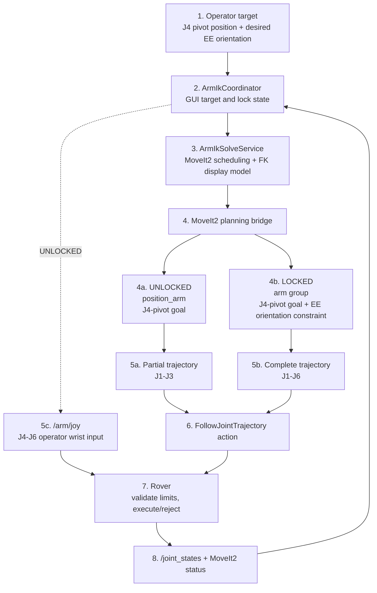

# Arm position control

Position mode is MoveIt2-only. The GUI owns the J4-pivot target, the desired
end-effector orientation, and the local LOCKED/UNLOCKED choice. MoveIt2 plans
smooth joint-space motion; it does not require the GUI to interpolate or time
trajectory points. The rover remains authoritative for limits, acceptance,
execution, and actual joint telemetry.

## Responsibility boundary



`ArmIkSolveService` coalesces target updates and sends MoveIt2 a new target at
most every 500 ms while the operator is moving the target. A newer target
cancels the active rover trajectory and MoveIt2 replans from current rover
telemetry. A superseded GUI request resolves without becoming `INVALID`.

`/arm/target_pose` is a `geometry_msgs/PoseStamped` in `base_link`:

- `position` is the target position of `j4_pivot_link`.
- `orientation` is the desired orientation of `ee_link`.
- The timestamp carries the GUI request ID.

`/arm/orientation_lock` is a `std_msgs/Bool`. `false` selects UNLOCKED and
`true` selects LOCKED. Changing the lock state cancels the active trajectory
and causes the current target to be replanned.

In UNLOCKED mode, MoveIt2 uses the `position_arm` group and sends a partial
J1-J3 trajectory. The operator independently controls J4-J6 through
`/arm/joy`. Pressing L3 toggles the local orientation state while Position mode
is active. In LOCKED mode, MoveIt2 uses the full `arm` group, plans to the
J4-pivot position while constraining `ee_link` to the requested orientation,
and sends a complete J1-J6 trajectory. While LOCKED, joystick and trigger
wrist input is ignored and the captured orientation remains fixed until the
operator unlocks and locks again. Both modes use global joint-space
planning with time parameterization; neither requires a mathematically
straight-line end-effector path.

For LOCKED planning, the bridge first solves the proximal `position_arm` group
and then uses that result as the J1-J3 goal while the full `arm` group solves
the wrist orientation. This keeps the J4-pivot target and EE orientation
constraints compatible with the configured MoveIt2 kinematics solver.

## Model source of truth

The GUI model is [`public/assets/kinematics/arm.urdf`](../public/assets/kinematics/arm.urdf).
The MoveIt2 test stack uses the matching copy in
`test/moveit2/arm_moveit_config/config/arm.urdf`.

`j4_pivot_link` is a fixed frame at the `yaw_joint` origin. The terminal link
is `ee_link`. The six movable joints are:

1. `base_joint`
2. `shoulder_joint`
3. `elbow_joint`
4. `yaw_joint`
5. `pitch_joint`
6. `roll_joint`

The browser loads the URDF for rendering and forward-kinematics display only;
it does not solve IK. Entering LOCKED uses the current rover joint telemetry
to capture the current EE orientation. While LOCKED, MoveIt2 retains that
orientation and direct wrist input is inactive. Leaving LOCKED returns J4-J6
to the operator without a local preview or command jump.

## GUI API

```ts
const initialPose = await armIkSolveService.load();
const result = await armIkSolveService.solve({
  position: [x, y, z],
  orientation: [qx, qy, qz, qw],
  orientationMode: 'unlocked',
});

// MoveIt2 accepted and completed the trajectory; jointAngles is empty.
// A superseded target resolves as null.
```

The coordinator maps a converged MoveIt2 result to `VALID`, an unsuccessful
plan/execution result to `UNREACHABLE`, and a rejected request to `INVALID`.
Actual joint angles shown in the viewer always come from rover telemetry.

## Current limits

Implemented:

- MoveIt2 global planning for UNLOCKED and LOCKED Position mode.
- Partial J1-J3 and complete J1-J6 trajectory execution.
- EE orientation constraint in LOCKED mode.
- Time parameterization, cancellation, replanning, and MoveIt2 status events.
- J4-pivot target and rover-telemetry markers in the model viewer.
- Direct UNLOCKED wrist control through `/arm/joy`.
- L3 orientation-lock toggle in Position mode.

Not enabled yet:

- Collision geometry and obstacle-aware planning.
- Optional trajectory preview in the GUI.
