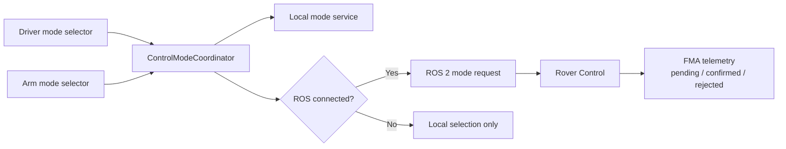
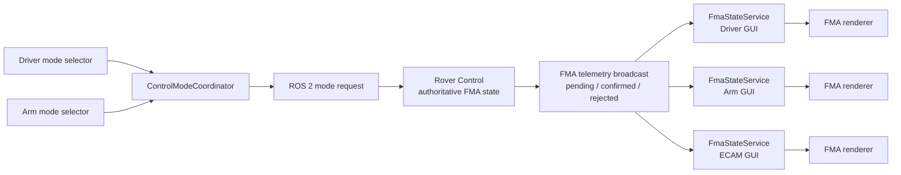

# Control Mode Responsibilities

This document explains the different kinds of control mode in the GUI. The
names are similar, but they answer different questions.

## The related services

| File                                               | Responsibility                                                                                                                                                  |
| -------------------------------------------------- | --------------------------------------------------------------------------------------------------------------------------------------------------------------- |
| `src/app/core/control/control-mode.ts`             | Global control authority: who currently owns control — `none`, `driver`, or `arm`. Command publishers use this to decide whether commands are allowed.          |
| `src/app/core/control/control-mode-coordinator.ts` | Coordinates mode selections, local mode services, and ROS connection state. It sends mode requests to ROS; rover telemetry remains authoritative for FMA state. |
| `src/app/core/control/drive/drive-control-mode.ts` | Driver control interpretation: `MANUAL` or `VELOCITY`.                                                                                                          |
| `src/app/core/control/arm/arm-control-mode.ts`     | Owns Arm interpretation mode, the shared Arm input session, and routing to the selected handler.                                                                |
| `src/app/core/control/arm/arm-manual-control.ts`   | Handles the Manual Arm gamepad mapping and publishes the existing `/arm/joy` command.                                                                           |
| `src/app/core/control/arm/arm-position-control.ts` | Handles the MoveIt2 Position Arm mapping, updates the J4-pivot target through `ArmIkCoordinator`, and sends UNLOCKED wrist input.                              |

In short:

- `ControlModeService` answers: **Who is allowed to control?**
- `DriverControlModeService` answers: **How should Driver input control the rover?**
- `ArmControlModeService` answers: **Which Arm input interpretation is selected, and which handler receives input?**
- `ControlModeCoordinator` answers: **How do selections and ROS connection become mode requests?**
- `ArmManualControl` answers: **How is the legacy direct-joint Arm mapping executed?**
- `ArmPositionControl` answers: **How does Position-mode input move the IK target and unlocked wrist?**

In MoveIt2 Position mode, D-pad X/Y moves the `j4_pivot_link` target in the
visible TOP/SIDE plane. The left joystick controls wrist yaw/pitch and LT/RT
control wrist roll through `/arm/joy` while UNLOCKED. In LOCKED mode joystick
and trigger wrist input is ignored; MoveIt2 owns all six joints and preserves
the EE orientation captured from rover telemetry when LOCKED was entered. To
change orientation, unlock, adjust the wrist, and lock again. Digital buttons,
target movement, RB camera controls, and Gimbal priority remain available.

## Control authority versus control interpretation

These are separate concepts. For example, the Driver can own control
authority while the Driver's selected interpretation mode is `VELOCITY`:

```text
Control authority:       DRIVER owns control
Driver interpretation:   VELOCITY
Arm interpretation:      POSITION
```

The authority service does not choose between `MANUAL`, `VELOCITY`, or
`POSITION`. Those choices belong to the subsystem-specific mode services.

## Current defaults

| Subsystem    | Local default | Meaning                                                                      |
| ------------ | ------------- | ---------------------------------------------------------------------------- |
| Driver       | `VELOCITY`    | Driver input is interpreted as assisted velocity control.                    |
| Arm Operator | `POSITION`    | Arm Operator input is interpreted as an end-effector position target for IK. |

The defaults are local GUI selections. They are not confirmed rover states.

The Arm master switch is the safety and authority gate used before a mission.
Once Arm control is active, the Arm Operator can still change between Manual
and Position. Position mode also has a local UNLOCKED/LOCKED orientation
selector; it does not create an FMA state.

## Selection and connection flow

The mode pages call the coordinator. They do not write to the FMA state store
directly.



When the coordinator observes a ROS connection:

1. It sends the current Driver and Arm local modes as mode requests.
2. It does this once for that connection transition.
3. It does not locally author the authoritative FMA state.

The rover publishes pending, confirmed, and rejected mode state through its
FMA telemetry. That FMA telemetry is broadcast to every GUI instance. When the
connection is lost, each browser hides or clears its displayed rover state
without changing the local Driver or Arm defaults/selections. When the
connection returns, those preserved local selections are requested again.

## Gamepad Joy contract

The browser Gamepad API reports LT and RT as analogue button values. Before a
Joy message is published, the GUI puts those values into `axes[]` and keeps
`buttons[]` digital:

| Topic | LT axis | RT axis | Trigger range |
| --- | ---: | ---: | --- |
| `/joy` | `axes[4]` | `axes[5]` | `0..1` |
| `/arm/joy` | `axes[8]` | `axes[9]` | `0..1` |

The corresponding trigger positions in `buttons[]` remain reserved as `0` so
the existing digital button indexes do not shift. Rover-side consumers must
read LT/RT from the agreed axes rather than from `buttons[]`.

## FMA state ownership

`FmaStateService` remains the shared store for the main FMA columns:



`FmaStateService` is a shared store only within one browser instance. The rover
FMA telemetry broadcast is what keeps the three browser instances synchronized.
The FMA component only renders its local store; it does not select modes,
create requests, reset modes, or coordinate the ROS connection.

For a mode request, the rover broadcasts the requested value so each FMA
displays it in blue while waiting for acknowledgement. Rover-confirmed state
is displayed in green. Rejected requests are cleared from each local
`FmaStateService` without becoming confirmed state. ECAM alert codes follow a
separate `ecam/alerts` path. See [`fma.md`](./fma.md) for the complete
annunciator definition.

## Naming reminder

When reading or changing code, first ask which question the code is answering:

| Question                                          | Use                        |
| ------------------------------------------------- | -------------------------- |
| Who owns control authority?                       | `ControlModeService`       |
| Which Driver mode is selected?                    | `DriverControlModeService` |
| Which Arm mode is selected?                       | `ArmControlModeService`    |
| How are selections synchronized with ROS and FMA? | `ControlModeCoordinator`   |
