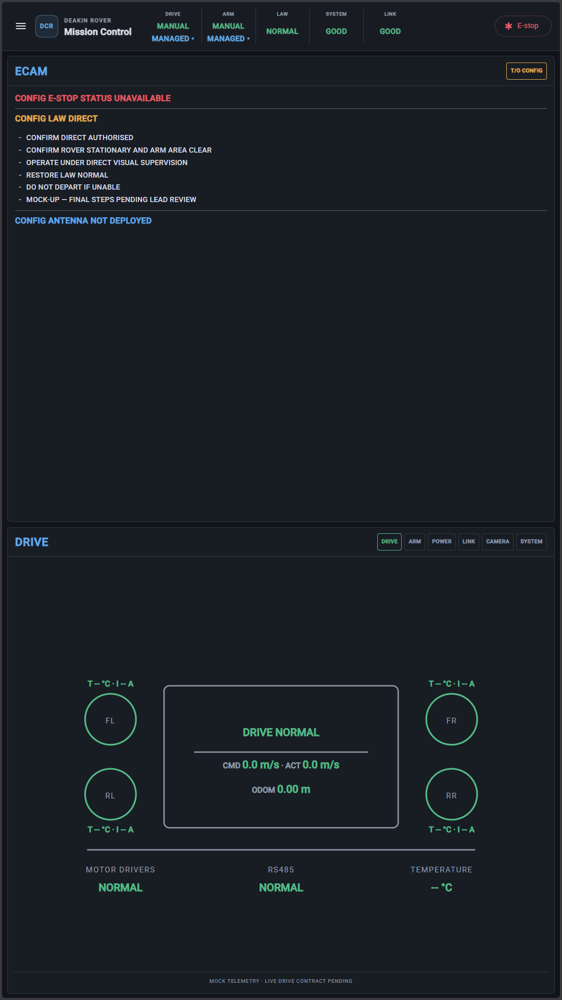
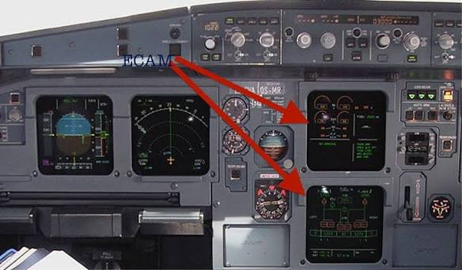
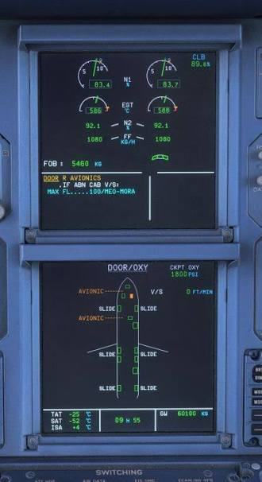
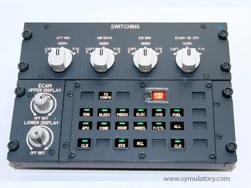
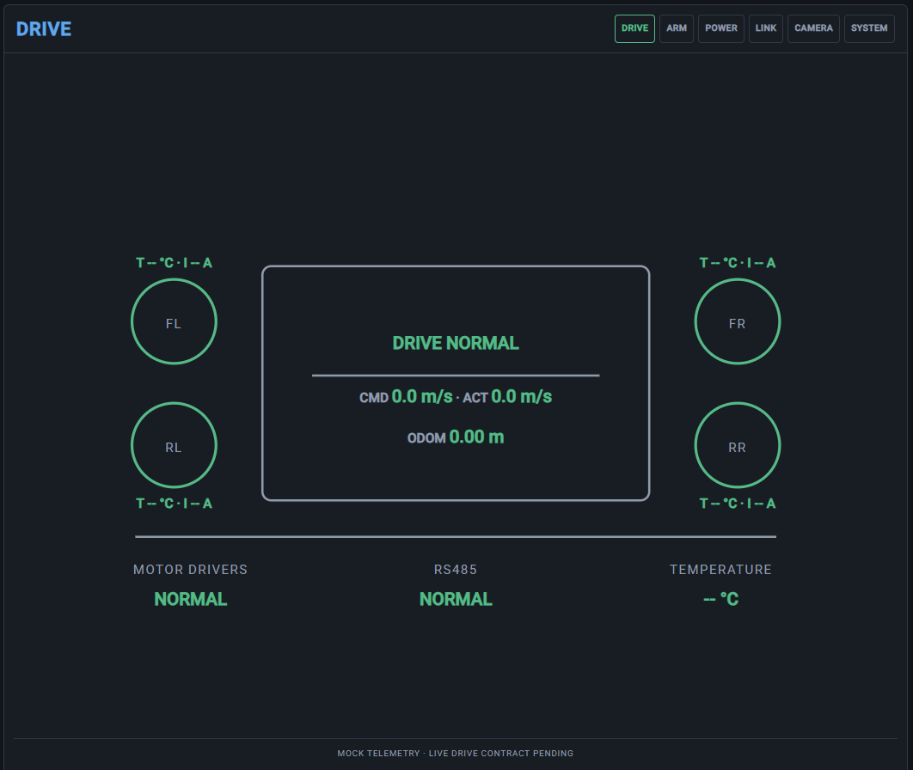
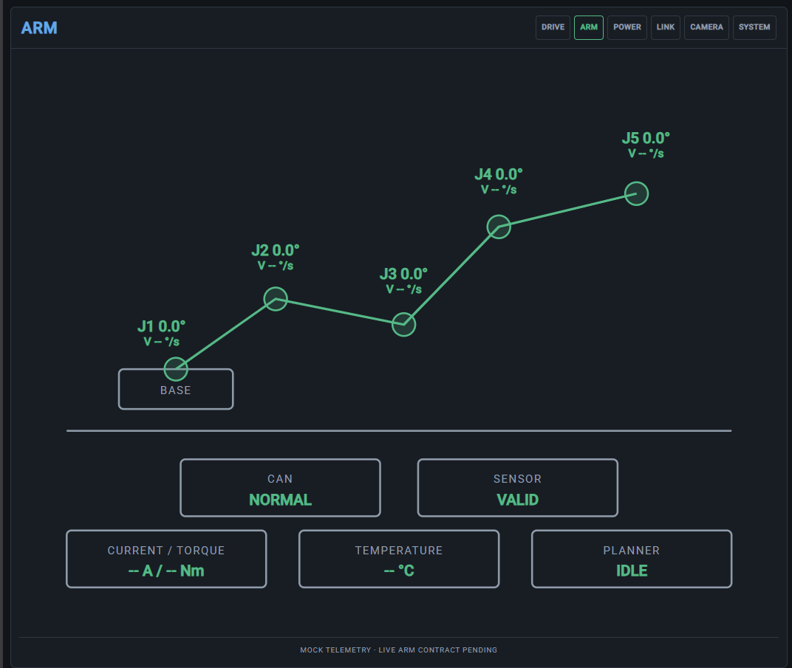
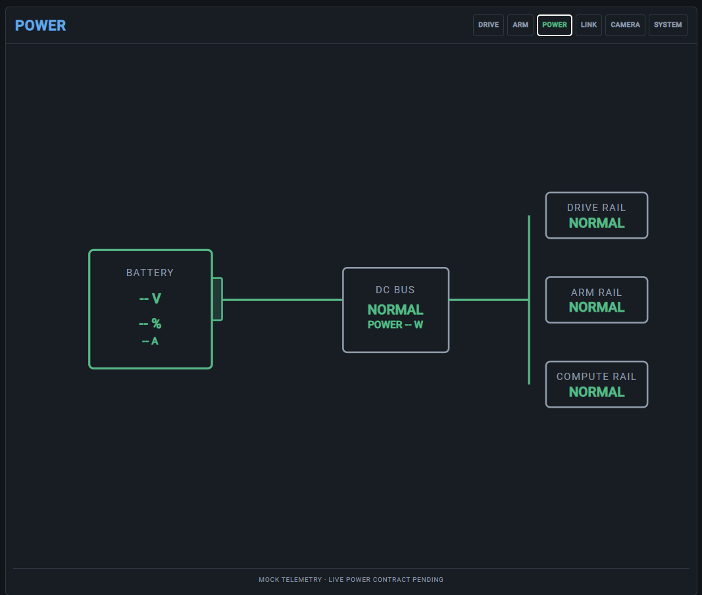
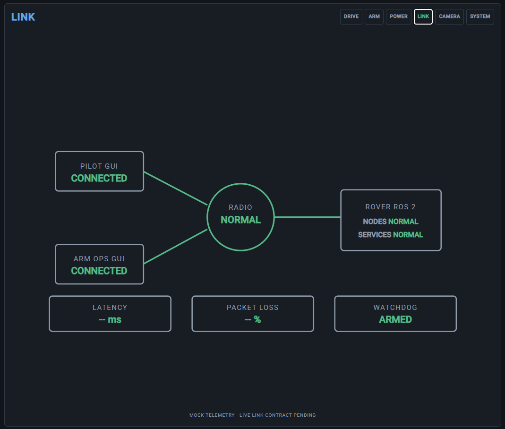
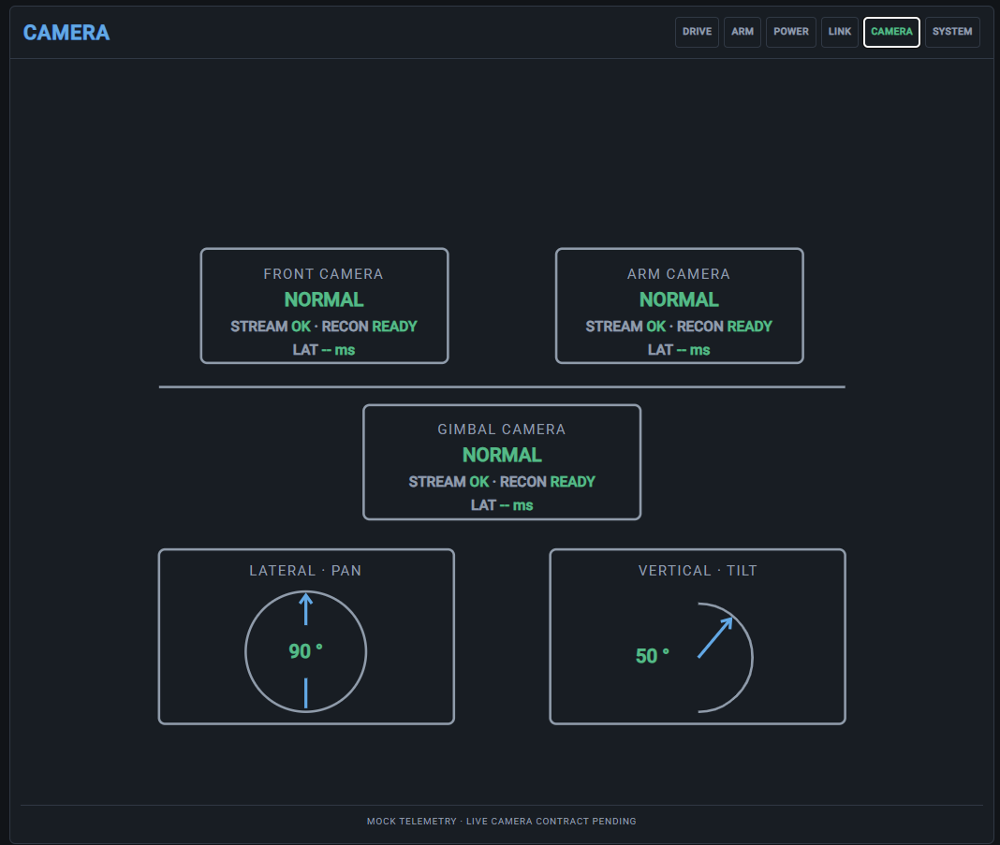
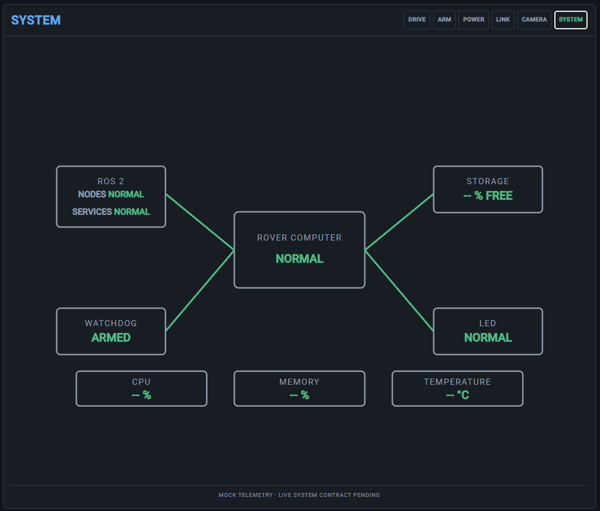

# Electronic Centralized Advisory Monitor (ECAM) and System Display (SD)

This document defines the intended behaviour of the rover's ECAM and lower System Display (SD). The design is inspired by the Airbus glass cockpit philosophy, but the content is specific to the Deakin rover and its competition workflow.

## Display responsibilities

The vertical ECAM view has two equal sections:

```text
┌──────────────────────────────┐
│ ECAM                         │  Upper display
│ Active alerts and procedures │
├──────────────────────────────┤
│ Selected system page         │  Lower System Display
│ Live subsystem schematic     │
└──────────────────────────────┘
```

The upper `ECAM` display answers:

> What needs attention, and what can the operator do about it?

The lower `SD` answers:

> What is happening inside the selected subsystem?

The FMA in the shared Mission Control header remains the high-level operational summary. The SD should show useful subsystem detail rather than duplicate the FMA.

## Visual references

### Current Angular implementation



### Airbus A320 references







## ECAM alert colours

Alert severity is defined centrally and must not be selected independently by individual UI components.

| Severity | Colour | Meaning |
|---|---|---|
| `attention` | Blue | Operator attention required |
| `warning` | Amber | Warning or degraded condition |
| `fault` | Red | Fault or condition preventing normal operation |

Active alerts are ordered by severity: faults first, then warnings, then attention messages. Alerts with the same severity are ordered by when they first appeared.

Each message has a stable alert code, for example:

```text
CONFIG_LAW_DIRECT
POWER_BATTERY_LOW
DRIVE_CONTROLLER_OFFLINE
```

The message catalogue owns the user-facing text, source subsystem, severity, and optional troubleshooting procedure.

## System Display colour convention

The SD uses colour to communicate state without colouring every element of a
page. Structure and supporting information remain neutral so the primary
system state is easy to find.

| Role | Colour | Use |
|---|---|---|
| Normal / valid state | Green | Confirmed healthy states and valid telemetry values, such as `NORMAL`, `OK`, `READY`, and `VALID`. |
| Neutral information | Grey | Outlines, labels, separators, units, and descriptive telemetry labels such as `STREAM`, `RECON`, and `LAT`. |
| Informational / interaction | Blue | Informational indications and operator-requested actions where a state has not yet been confirmed. |
| Warning / unknown | Amber | Degraded, stale, unavailable, or otherwise uncertain state. |
| Fault / critical | Red | Confirmed fault or condition requiring immediate operator attention. |

Normal SD boxes use neutral outlines by default. A healthy state is shown by
the relevant status text or value rather than by turning the entire box green.
Amber or red outlines may be used when the box itself must clearly indicate a
warning or fault. Unknown or stale telemetry must never continue to appear as
green normal data.

## ECAM core

The GUI contains one application-wide `EcamAlertService` under `core/ecam/`.

Features raise and clear stable alert codes through the service. They do not choose colours, message wording, or ordering. The service deduplicates repeated codes and exposes one active-alert list to the ECAM, Pilot, Arm, and FMA interfaces.

The current core consists of:

- `ecam-alert.types.ts` — alert, severity, source, and procedure models.
- `ecam-message-catalog.ts` — the central message definitions.
- `ecam-alert.service.ts` — active alert state and ordering.

The service is currently GUI-local. It is not yet connected to rover telemetry or a shared ROS alert topic.

## T/O CONFIG behaviour

`T/O CONFIG` is an operator-requested pre-departure configuration check. The
GUI sends the request first; rover-side Control evaluates the current
configuration and returns the authoritative result.

```text
GUI button press
  → configuration check request
  → rover-side Control evaluation
  → configuration result returned to the GUI
  → ECAM displays the result and individual conditions
```

The response result is `NORMAL`, `FAILED`, or `UNKNOWN`. Rover-side Control is
authoritative for the evaluation; the GUI displays the returned result and does
not independently decide whether the rover is ready. When the result is
`FAILED` or `UNKNOWN`, the response includes the individual ECAM codes for the
conditions found by the rover. The GUI resolves those codes through the ECAM
message catalogue.

The button represents the returned state:

- `NORMAL` is shown in green.
- `FAILED` or `UNKNOWN` is shown in amber.
- Blue hover/focus indicates that the GUI is requesting a check, not that the
  check has passed.

`T/O CONFIG` is advisory and does not itself inhibit driving. `T/O CONFIG
NORMAL` confirms that the rover passed the checks at the moment the button was
pressed; it does not guarantee that the rover will remain healthy afterward.
If a condition remains unresolved, its active ECAM message remains visible until
the underlying condition is cleared.

If the rover-side result is unavailable or stale, the GUI must show the check as
unknown or unavailable rather than displaying it as normal. If the GUI receives
no response within its request window, it owns the local timeout/unavailable
indication and shows an appropriate ECAM message.

See [GUI telemetry requirements](telemetry-requirements.md#to-config-contract)
for the response package, recovery-snapshot, and timeout contract.

## Multiple operator PCs

The Angular singleton is local to one browser instance. It cannot directly share state between the Pilot, Arm, and ECAM PCs.

The intended competition architecture is:

```text
Rover Control / health nodes
  → rover health topics
                         ┐
Pilot GUI ── station status ─┤
Arm GUI ─── station status ──┤→ ECAM relay/aggregator
                              └→ /ecam/alerts

Pilot GUI  ←────────────── /ecam/alerts
Arm GUI    ←────────────── /ecam/alerts
ECAM GUI   ←────────────── /ecam/alerts
```

The relay/aggregator is a separate shared service or ROS node, not part of the ECAM GUI. It will become the shared source of truth. The GUIs will each maintain a local copy of the canonical alert state.

Rover Control owns rover faults and health. Pilot and Arm GUIs only report station-local conditions, such as a browser being unable to display a camera. They do not become the source of truth for global rover alerts.

If a station loses ROS completely, it cannot report its own failure. The relay must detect the missing station heartbeat and create a station-link alert itself.

The shared alert state should update when an alert is raised, changed, or cleared, and remain recoverable when a client reconnects or misses an update.

A local browser failure should identify its station. For example, a Pilot browser failing to load a camera should report `PILOT FRONT CAMERA VIEW UNAVAILABLE`, not necessarily claim that the rover camera itself is broken.

## System Display pages

The current System Display page set is:

- `DRIVE` — wheel and motor status, commanded versus actual motion, controller health, and drive faults.
- `ARM` — joint positions, soft limits, position-sensor validity, protection state, and planner status.
- `POWER` — battery voltage, current draw, power-rail health, and subsystem power where available.
- `LINK` — ROS/network health, latency, packet loss, and controller connections.
- `CAMERA` — feed availability and stream health.
- `SYSTEM` — compute health, ROS nodes/services, storage, and overall diagnostics.

`THERMAL` and `AUTONOMY` can be added when their telemetry is available and substantial enough to justify dedicated pages.

### Current System Display implementation

The current GUI implementation provides the following six SD pages. The values
shown in these screenshots are mock telemetry pending the live rover telemetry
contract.













The SD page header shows the selected system name. Each page currently provides
a simple symbolic schematic. Live telemetry will populate the values while
remaining layered onto meaningful system components.

See [GUI telemetry requirements](telemetry-requirements.md) for the required
telemetry, update rates, recovery snapshots, and per-page SD data contract.

```text
SVG = system topology
Telemetry = live state
ECAM = why something needs attention
```

SVGs should remain symbolic and readable on the vertical display, rather than becoming detailed CAD drawings.

## Troubleshooting procedures

An ECAM message may include an optional procedure made of ordered, remotely actionable steps. Procedures should focus on actions available from the operator stations, not physical maintenance tasks that require touching the rover during competition.

For example, `CONFIG_LAW_DIRECT` can provide steps to confirm authorisation, verify clearance, operate under visual supervision, restore `LAW NORMAL`, and stop the mission if normal protection cannot be restored.

Procedure steps have stable IDs so a future interactive checklist can track completion without changing the message catalogue. For now, procedures are displayed as indented dash bullets.

The ECAM display is informative and procedural. Rover-side Control remains authoritative for E-stop, motion limits, watchdogs, and all safety-critical inhibition.

## Future auto-page behaviour

An alert can later identify a relevant SD page through its source or an explicit page association:

```text
DRIVE_CONTROLLER_OFFLINE → DRIVE
CONFIG_ARM_NOT_STOWED    → ARM
POWER_BATTERY_LOW        → POWER
LINK_DEGRADED             → LINK
```

The SD should not constantly jump between pages when multiple alerts arrive. A new critical fault may request or temporarily select its relevant page, while the operator should retain control for ordinary alerts.
