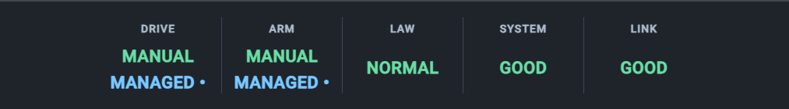
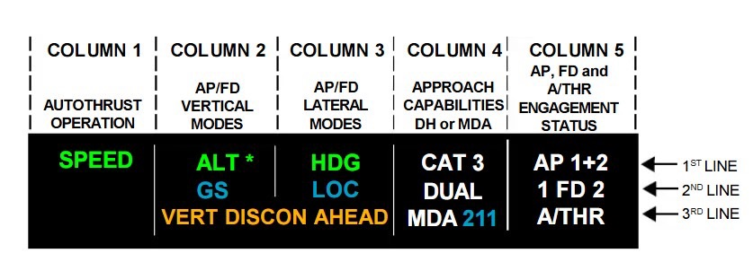
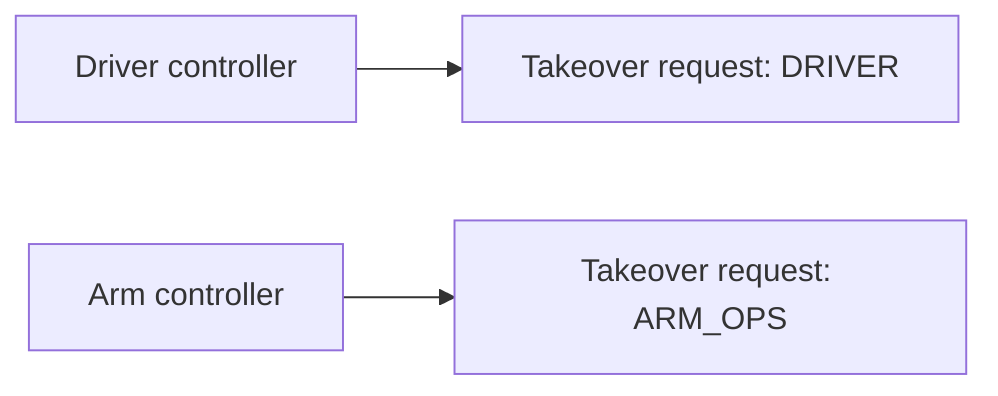
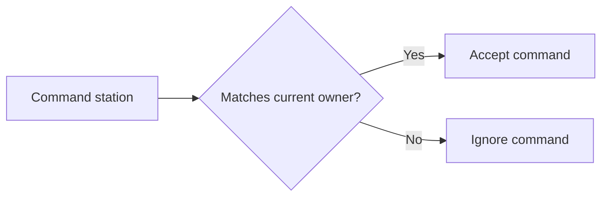

# Rover Functional Mode Annunciator Definitions

This document defines the five Functional Mode Annunciator (FMA) columns used in the rover GUI:

**DRIVE | ARM | LAW | SYSTEM | LINK**

The FMA should display the rover's **confirmed active state**, not merely a requested state.

## Visual references

### Current Angular implementation



### Airbus A320 reference



---

## FMA Interaction Behaviour

The FMA displays the **confirmed rover state** and any explicitly rover-reported
pending request state. A local operator click is never treated as confirmed by
itself.

### Command pending
When an operator selects a mode from the GUI, the request is sent to the rover.
The rover broadcasts the pending requested mode, which is shown in **blue** by
every GUI while the command is waiting for acknowledgement.

At GUI startup, Driver defaults to `VELOCITY` and Arm defaults to `POSITION`.
While the rover connection is unavailable, these remain local selections and
are not shown as FMA requests. Once the connection is established, the
coordinator requests them and the rover broadcasts the pending state in blue
until telemetry confirms them.

When ROS is disconnected, the FMA hides all status values, including Gimbal
Priority, and shows the unavailable red X overlay. The X represents the
overall cold-and-dark state; individual `UNKNOWN` values are used only after
ROS is connected.

### Command confirmed
Once the rover receives the command, changes state, and broadcasts the
acknowledgement/confirmed state, the mode changes to **green** on every GUI.

### Command rejected / no acknowledgement
If the rover rejects the command, it broadcasts the rejection. The pending
requested mode must not become active; every FMA should continue displaying the
last confirmed state or indicate the failure through the appropriate system
warning. If no response is received, the GUI must not invent a confirmed state.

Example:

`MANUAL` → operator selects `VELOCITY`

`VELOCITY` **blue** → command sent / awaiting acknowledgement

`VELOCITY` **green** → rover acknowledged and confirmed the mode

---

## 🚙 DRIVE

This column answers:

> **How is the rover currently being driven?**

### `MANUAL`

Raw skid-steer control.

The Driver directly controls the **left and right wheel groups independently** using the gamepad. Used as a fallback when the higher-level drive controller has problems.

### `VELOCITY`

Normal assisted driving mode.

The Driver uses a **single joystick** for forward/backward movement and left/right rotation. These become linear and angular velocity commands through `cmd_vel`, and the drivetrain controller calculates the required left/right wheel speeds.

### `MANAGED •`

Autonomous control owns the drivetrain.

Nav2 or another autonomy component generates the movement commands instead of the Driver.

### No displayed mode

If there is no valid connection or confirmed drive mode, do not display a green
confirmed mode or a pending request. A local startup or operator selection is
not placed in the FMA until a valid rover connection exists.

---

## 🦾 ARM

This column answers:

> **How is the robotic arm currently being controlled or configured?**

### `MANUAL`

Direct joint control.

Arm Ops uses the gamepad to command **individual joints directly**. Used when IK or motion planning cannot produce a sensible solution.

### `POSITION`

Solver-assisted control.

Arm Ops specifies a desired **end-effector position/pose**. The GUI solves the
joint angles from the arm URDF; the rover validates and executes the resulting
joint-angle command. Motion planning remains future work.

### `MANAGED •`

Higher-level automation owns the arm.

An autonomous routine or task sequence commands arm motion without continuous manual input from Arm Ops.

### `STOWED`

The arm is parked in its designated travel configuration.

It stays folded close to the rover when not in use, helping maintain a good **center of gravity**.

---

## 🛡️ LAW

This refers specifically to **arm protection**.

LAW design reference: Airbus A320 control laws, adapted for Arm control of the rover.

[Airbus A320 Flight Laws – Interactive PFD Reference](https://airbus-a320-explainer.vercel.app/)

### `NORMAL`

Full protection available.

Both the **GUI-side protection**, which uses rover telemetry to monitor arm position, and the **rover-side low-level soft end-stop protection** are functioning normally.

### `ALTERNATE`

GUI-side protection is unavailable because the required rover telemetry or communication has been lost.

The **rover-side low-level soft end-stop protection remains active**, so the arm can still operate with reduced protection.

### `DIRECT`

Protection override deliberately selected.

Normal soft-limit protection is bypassed to give Arm Ops direct authority when required. The physical/system safety mechanisms, including E-STOP, still remain available.

If Arm Ops selects the override:

`LAW: NORMAL → DIRECT`

This annunciation makes it clear that the arm is operating without its normal protection layer.

---

## 🎥 GIMBAL PRIORITY

The Gimbal Priority indicator is displayed directly beneath the `LAW` state in
the FMA. It is a separate secondary indicator and is **not** an additional LAW
state or a sixth FMA column.

The indicator shows which operator station currently owns authority to command
the shared physical Gimbal camera:

```text
← DRIVER       ARM OPS →
```

`← DRIVER` means that the Driver owns Gimbal priority. `ARM OPS →` means that
the Arm Operator owns Gimbal priority.

The arrow direction is an ownership indication, not the direction of Gimbal
movement. The left arrow always represents `DRIVER`; the right arrow always
represents `ARM_OPS`.

#### Shared Gimbal ownership

Both the Driver GUI and Arm Operator GUI may view and control the same physical
Gimbal camera. Each physical controller has a dedicated **GIMBAL PRIORITY**
button.

Pressing the button sends a Gimbal takeover request containing the identity of
the requesting station:



The rover owns the authoritative Gimbal owner and priority state. When a valid
takeover request is received, the rover updates the owner and broadcasts the
confirmed owner state to every GUI instance.

There is no additional Driver-over-Arm hierarchy. If both operators press their
priority buttons at approximately the same time, the latest valid request
received by the rover wins.

#### Gimbal movement commands

Every Gimbal movement command, including D-pad commands, must include the
identity of the sending station. The rover validates every command against its
authoritative owner state:



The local GUI must not block a movement command or takeover request solely
because its cached owner state says that the station is not the current owner.
The cached state may be stale. The rover remains responsible for final command
validation and enforcement.

There is no dual-input summing. Only commands from the rover-confirmed current
owner are accepted.

#### Owner indication and stale state

The rover should publish the owner immediately after an ownership change and
periodically thereafter so that GUI instances can recover from missed updates or
reconnects.

If ROS is connected but owner telemetry is null, explicitly unknown, or stale,
the GUI must not continue to show the last known owner as valid. The FMA must
instead display:

```text
GIMBAL PRIORITY UNKNOWN
```

The GUI must receive a fresh authoritative owner state before showing either
`← DRIVER` or `ARM OPS →` again.

Verbal callouts such as “I have gimbal” and “You have gimbal” may be used as
human operating procedure, but they have no software effect. The mapped
**GIMBAL PRIORITY** button is the only action that changes software ownership.

---

## 🖥️ SYSTEM

This column answers:

> **Is the underlying rover system okay?**

### `GOOD`

Required ROS/control nodes, communications, and controllers are healthy.

### `DEGRADED`

Something has failed or disconnected, but the rover remains operational. For example, a camera may be unavailable while drive and control remain functional.

### `FAULT`

A significant failure prevents normal operation or requires operator attention.

### `E-STOP`

Emergency stop is active. Actuation is disabled and a deliberate reset/re-arm action is required before operation can resume.

---

## 📡 LINK

This column answers:

> **How healthy is the communication link between the rover and base station?**

### `GOOD`
Communication is healthy. Commands, telemetry, and other required data are being transmitted normally.

### `DEGRADED`
The link is still usable, but communication quality has deteriorated due to latency, packet loss, reduced bandwidth, or similar issues.

### `LOST`
Communication with the rover has been lost.

### No displayed mode
If link status is not available or has not yet been established, **display nothing**.

---

## FMA Summary

| Column | Purpose | Modes |
|---|---|---|
| **DRIVE** | Current drivetrain control method | `MANUAL`, `VELOCITY`, `MANAGED •` |
| **ARM** | Current arm control/configuration | `MANUAL`, `POSITION`, `MANAGED •`, `STOWED` |
| **LAW** | Arm protection level | `NORMAL`, `ALTERNATE`, `DIRECT` |
| **SYSTEM** | Overall rover/control-stack health | `GOOD`, `DEGRADED`, `FAULT`, `E-STOP` |
| **LINK** | Rover/base-station communication health | `GOOD`, `DEGRADED`, `LOST` |

The Gimbal Priority indicator is displayed beneath the `LAW` column but is not
part of the LAW value. It reports shared Gimbal ownership independently from the
Arm protection state.
