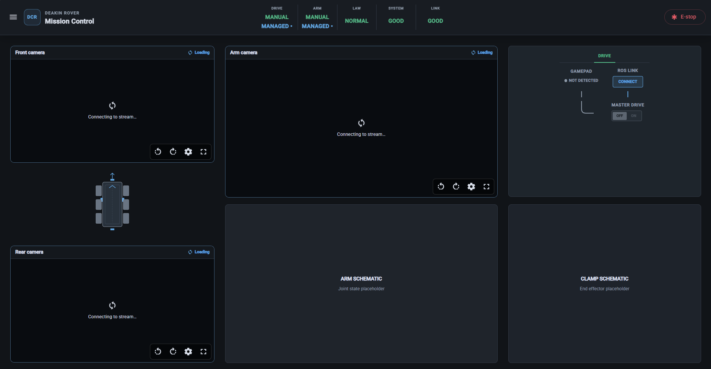

# Operator Layouts

The operator interface is **inspired by the Airbus glass cockpit philosophy**. A symbolic rover remains central while live camera feeds and telemetry are arranged according to the active operator's task.

The `MissionControl` shell renders the selected operator dashboard; it does not itself own the camera feeds or rover schematic.

## Current Angular implementation




## Pilot view

```text
┌───────────────────────────────────────────────┬──────────────┐
│ Front camera                                  │ Gimbal view  │
│ primary driving view                          │ shared/control│
├───────────────────────────────┬───────────────┼──────────────┤
│ Rover schematic                │ Arm camera    │ Pilot        │
│                               │ context       │ control      │
├───────────────────────────────┴───────────────┤ panel        │
│ Gimbal overhead view and priority status      │              │
└───────────────────────────────────────────────┴──────────────┘
```

The Front camera is the current proposed primary Pilot view, but the final Pilot
camera priority must be confirmed with the Pilot. The controllable Gimbal camera
provides a shared overhead/bird's-eye view. The Arm camera remains available for
context where screen space allows. The previous Left/Right/Rear arrangement is
not the current proposed hardware layout.

The right sidebar places the shared Gimbal view and priority status above the
Pilot control panel. The Pilot controller includes the **GIMBAL PRIORITY** button.
The control panel owns the ROS link, gamepad status, Drive controls, and Gimbal
priority indication, while the rover remains authoritative for Gimbal ownership.

## Arm operator view

```text
┌──────────────────┬───────────────────────┬──────────────────┐
│ Front rover cam  │ Arm camera            │ Arm control panel │
│ context          │ primary               │ Gimbal priority   │
├──────────────────┤                       │ and status        │
│ Rover schematic  ├───────────────────────┼──────────────────┤
│                  │ Gimbal overhead view  │ Clamp schematic   │
│                  │ and direction/control │ placeholder       │
└──────────────────┴───────────────────────┴──────────────────┘
```

The Arm camera is the current proposed primary Arm Operator view. The Front
camera provides rover context, while the shared Gimbal provides overhead
positioning and situational awareness. Both Pilot and Arm Operator GUIs may view
and control the same physical Gimbal.

The Arm control panel includes the **GIMBAL PRIORITY** button, gamepad status,
ROS link state, Arm controls, and the authoritative Gimbal owner indication. A
local cached owner must not be used to block takeover requests or movement
commands; the rover validates station identity and ownership.

The Arm schematic is currently a placeholder for future joint, end-effector, limit, and MoveIt-derived state. The clamp schematic is also a placeholder until the end-effector telemetry and command contract exists.
