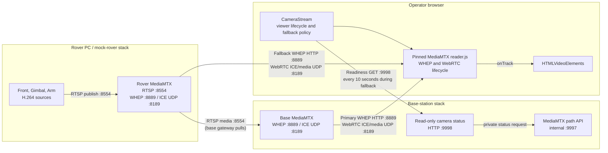

# WebRTC camera stream

The GUI normally reads rover cameras through the base-station MediaMTX. A
second MediaMTX on the rover provides direct fallback video when the base
station gateway is unavailable. The rover camera publisher sends each feed
once to rover MediaMTX; the base-station gateway pulls those feeds over RTSP.

This document defines the camera contract and the local stack used to develop
and validate it. It does not define camera hardware, radio settings, or rover
control/telemetry behavior.

## Stack



The synthetic development sources use FFmpeg to publish visually distinct
H.264 RTSP feeds to rover MediaMTX. The base-station gateway pulls each path
from the rover, while a browser can subscribe directly to the rover gateway
only for its permitted fallback cameras.

## Camera contract

`CameraSource` is the GUI's stable camera configuration shape:

| ID       | Label         | Base WHEP                           | Rover fallback WHEP (local)         |
| -------- | ------------- | ----------------------------------- | ----------------------------------- |
| `front`  | Front camera  | `http://localhost:8889/front/whep`  | `http://localhost:8890/front/whep`  |
| `gimbal` | Gimbal camera | `http://localhost:8889/gimbal/whep` | `http://localhost:8890/gimbal/whep` |
| `arm`    | Arm camera    | `http://localhost:8889/arm/whep`    | `http://localhost:8890/arm/whep`    |

The gateway host is configured at build time through the Angular environment
files:

```ts
// src/environments/environment.ts
export const environment = {
  cameraGatewayUrl: 'http://localhost:8889',
  roverCameraGatewayUrl: 'http://localhost:8890',
  cameraHealthUrl: 'http://localhost:9998/cameras/status',
};
```

The production build replaces this file with
`src/environments/environment.production.ts`. Set its value to the base-station
address, such as `http://basestation.local:8889`. Production fallback uses
`http://rover.local:8889`, and the status check uses
`http://basestation.local:9998/cameras/status`. The WHEP paths remain unchanged.

Each `CameraStream` creates its own reader and WebRTC session. Two operators
can therefore view the Gimbal simultaneously without sharing a browser video
element or a session lifecycle.

The Angular application loads the official MediaMTX `reader.js` helper from
`public/mediamtx`. It is pinned to MediaMTX v1.21.1, matching the Compose
gateway image. The helper owns WHEP negotiation, codec handling, trickle ICE,
and transport-level recovery. The Angular adapter only supplies the endpoint,
attaches the incoming track to a muted `HTMLVideoElement`, updates the UI, and
calls `reader.close()` when the viewer is replaced or destroyed.

## Failover and recovery

| State                           | Meaning                                                                                                                                  |
| ------------------------------- | ---------------------------------------------------------------------------------------------------------------------------------------- |
| `connecting`                    | A configured viewer is creating its initial reader session.                                                                              |
| `live` (`streaming` internally) | A remote video track is attached to the video element.                                                                                   |
| `reconnecting`                  | A live reader is recovering its transport, or the component is waiting to retry an initial failure.                                      |
| `error`                         | The current gateway's automatic reader retries are exhausted; the operator can use **Retry** while background readiness checks continue. |
| `unavailable`                   | The browser lacks WebRTC support or the MediaMTX reader asset was not loaded.                                                            |

There is also a `not-configured` state for a viewer with no `CameraSource`.
Camera playback is not gated by ROSbridge state: a valid WHEP endpoint is
enough to start a viewer.

If the base-station stream has not become live after about ten seconds, the GUI
switches eligible tiles to rover MediaMTX. Driver Arm and Arm Front do not open
a rover session; they show the existing unavailable overlay instead. Other
tiles keep one reader session for the gateway currently displayed.

While a rover fallback is displayed (or a restricted tile is unavailable),
the GUI requests `GET /cameras/status` from the base-station health endpoint
every ten seconds. This tiny read-only response reports path readiness; it
does not open a hidden video session or interrupt the displayed rover feed.
After the relevant path has remained ready for more than ten seconds, the GUI
opens the base WHEP session in the background. It keeps the rover video visible
until the base session attaches a video track, then switches and closes the
rover reader. If the base WHEP attempt fails, the GUI keeps the fallback and
continues checking.

Recovery ownership is deliberately split:

- After a track has been received, `reader.js` owns the transport recovery and
  reports the viewer as `reconnecting` until it supplies another track.
- If the initial reader setup fails, `CameraStream` closes that reader and
  retries every five seconds until failover begins.
- While in fallback mode, the GUI owns the ten-second status polling and the
  stable-ready window; only a confirmed live base track triggers the switch.
- Replacing a source or destroying a component closes the active reader and
  cancels any pending component retry.

## Local development runbook

On Windows, enable Docker Desktop host networking (Docker Desktop 4.34 or
newer). Start the mock rover from `test/mock_rover` and the base-station stack
in either order. Before the first start, create the shared local camera network
once:

```bash
docker network create chasmata-local-media
```

Then start the mock rover:

```bash
docker compose up --build
```

Then start the base-station stack from `basestation`:

```bash
docker compose -f docker-compose.local.yml up --build
```

MoveIt and the mock rover ROS services use host networking to connect through
the rover-side discovery server. MediaMTX remains on Docker's regular network
with its TCP/UDP ports published for camera traffic. On Linux, host networking
is native.

The mock rover starts ROSbridge on `9090`, discovery on UDP `11811`, rover
MediaMTX, and three synthetic RTSP publishers. The local rover gateway uses
host ports RTSP `8555`, WHEP `8890`, and ICE UDP `8190`. Base-station MediaMTX
provides primary WHEP on `8889` and ICE UDP `8189`; its read-only camera status
endpoint is TCP `9998` (the internal MediaMTX API is `9997`).

The synthetic publishers send RTSP to the rover gateway using the Compose
service name. The base-station gateway pulls the rover feeds from
`rover-media-gateway:8554` over the shared local Docker network.

Then start the GUI from `gui` with `npm start` and open
<http://localhost:4200>. The Front, Gimbal, and Arm views should become
`live`. Open a second dashboard or browser window to confirm that the Gimbal
has an independent viewer session.

The synthetic source profile can be configured before `docker compose up`:

| Variable                  | Default         | Purpose                                                |
| ------------------------- | --------------- | ------------------------------------------------------ |
| `MEDIA_WIDTH`             | `1280`          | Frame width in pixels.                                 |
| `MEDIA_HEIGHT`            | `720`           | Frame height in pixels.                                |
| `MEDIA_FPS`               | `30`            | Frames per second.                                     |
| `MEDIA_BITRATE_KBPS`      | `2500`          | H.264 target and maximum bitrate.                      |
| `MEDIA_BUFFER_KBPS`       | `5000`          | H.264 encoder buffer size.                             |
| `MEDIA_KEYFRAME_INTERVAL` | `30`            | H.264 GOP/keyframe interval in frames.                 |
| `MEDIA_GATEWAY_HOST`      | `media-gateway` | Rover MediaMTX service receiving synthetic RTSP feeds. |
| `MEDIA_GATEWAY_RTSP_PORT` | `8554`          | Rover MediaMTX RTSP ingest port inside Compose.        |

For example, start a lower-bandwidth profile with:

```powershell
$env:MEDIA_WIDTH = '854'
$env:MEDIA_HEIGHT = '480'
$env:MEDIA_FPS = '20'
docker compose up --build
```

## Troubleshooting

| Symptom                                  | Check                                                                                                                                                              |
| ---------------------------------------- | ------------------------------------------------------------------------------------------------------------------------------------------------------------------ |
| `unavailable` immediately                | Confirm the browser supports `RTCPeerConnection` and `public/mediamtx/reader.js` is served by the GUI.                                                             |
| A camera remains `connecting` or retries | Check MediaMTX logs and verify the expected path is receiving its publisher.                                                                                       |
| Browser cannot reach primary WHEP        | Confirm base-station port `8889` is published, the Angular environment points to the base station, and the GUI origin is included in `MEDIA_WEBRTC_ALLOW_ORIGINS`. |
| Browser cannot reach rover fallback      | Confirm rover WHEP `8889` and ICE UDP `8189` are reachable, and the rover gateway advertises its LAN address. Local mock uses `8890`/UDP `8190`.                   |
| A camera stays unavailable               | Check rover source publishing, the base gateway's RTSP pull, and `http://localhost:9998/cameras/status`.                                                           |
| Synthetic source cannot publish          | Confirm the rover MediaMTX container is running and the publisher targets its Compose service name.                                                                |
| Remote WebRTC fails                      | Set each gateway's advertised host to its own static LAN IP and permit its ICE UDP port end-to-end.                                                                |
| Compose cannot start                     | Start Docker Desktop's Linux engine, then rerun `docker compose up --build`.                                                                                       |

## Boundaries

The checked-in rover stack is a development profile: it uses HTTP,
unauthenticated WHEP, localhost CORS origins, and synthetic sources. A real
rover must run its own MediaMTX gateway, advertise its static LAN address, and
allow the operator GUI origins before direct fallback can work. Production
TLS, authentication/authorization, final camera selection, and radio/ICE
tuning remain separate deployment work.
