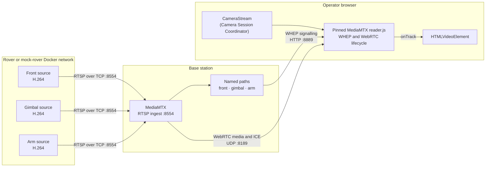

# WebRTC camera stream

The GUI reads rover cameras through WebRTC. MediaMTX runs on the base station:
it receives H.264 camera feeds over RTSP from the rover-side camera pipeline
and presents each feed to operator browsers through a WHEP playback endpoint.
The base station advertises its static LAN address for WebRTC ICE; the browser
does not connect to a Docker-private address.

This document defines the camera contract and the local stack used to develop
and validate it. It does not define camera hardware, radio settings, or rover
control/telemetry behavior.

## Stack



The synthetic development sources use FFmpeg to publish visually distinct
H.264 RTSP feeds to the base-station gateway. A production camera pipeline
must likewise provide H.264 or RTSP input to MediaMTX; it is not coupled to
the browser implementation.

## Camera contract

`CameraSource` is the GUI's stable camera configuration shape:

| ID | Label | Development WHEP endpoint |
| --- | --- | --- |
| `front` | Front camera | `http://localhost:8889/front/whep` |
| `gimbal` | Gimbal camera | `http://localhost:8889/gimbal/whep` |
| `arm` | Arm camera | `http://localhost:8889/arm/whep` |

The gateway host is configured at build time through the Angular environment
files:

```ts
// src/environments/environment.ts
export const environment = {
  cameraGatewayUrl: 'http://localhost:8889',
};
```

The production build replaces this file with
`src/environments/environment.production.ts`. Set its value to the base-station
address, such as `http://basestation.local:8889`, before building the GUI. The
WHEP paths remain unchanged.

Each `CameraStream` creates its own reader and WebRTC session. Two operators
can therefore view the Gimbal simultaneously without sharing a browser video
element or a session lifecycle.

The Angular application loads the official MediaMTX `reader.js` helper from
`public/mediamtx`. It is pinned to MediaMTX v1.21.1, matching the Compose
gateway image. The helper owns WHEP negotiation, codec handling, trickle ICE,
and transport-level recovery. The Angular adapter only supplies the endpoint,
attaches the incoming track to a muted `HTMLVideoElement`, updates the UI, and
calls `reader.close()` when the viewer is replaced or destroyed.

## Viewer states and recovery

| State | Meaning |
| --- | --- |
| `connecting` | A configured viewer is creating its initial reader session. |
| `live` (`streaming` internally) | A remote video track is attached to the video element. |
| `reconnecting` | A live reader is recovering its transport, or the component is waiting to retry an initial failure. |
| `error` | Ten initial connection retries have failed; the operator can use **Retry**. |
| `unavailable` | The browser lacks WebRTC support or the MediaMTX reader asset was not loaded. |

There is also a `not-configured` state for a viewer with no `CameraSource`.
Camera playback is not gated by ROSbridge state: a valid WHEP endpoint is
enough to start a viewer.

Recovery ownership is deliberately split:

- After a track has been received, `reader.js` owns the transport recovery and
  reports the viewer as `reconnecting` until it supplies another track.
- If the initial reader setup fails, `CameraStream` closes that reader and
  creates a fresh one every five seconds, up to ten attempts.
- Replacing a source or destroying a component closes the active reader and
  cancels any pending component retry.

## Local development runbook

On Windows, enable Docker Desktop host networking (Docker Desktop 4.34 or
newer). Start the mock rover from `test/mock_rover` and the base-station stack
in either order:

```bash
docker compose up --build
```

Then start the base-station stack from `basestation`:

```bash
docker compose -f docker-compose.local.yml up --build
```

MoveIt and the mock rover ROS services use host networking to connect through
the rover-side discovery server. MediaMTX remains on Docker's regular network
with its TCP/UDP ports published for camera traffic. On Linux, host networking
is native.

The mock rover starts ROSbridge on `9090`, discovery on UDP `11811`, and the
three synthetic RTSP publishers. The base station exposes MediaMTX RTSP ingest
on TCP `8554`, WHEP/HTTP on `8889`, WebRTC UDP/ICE on `8189`, and its
development-only API on `9997`.

On Windows, the mock publishers reach the base gateway through
`host.docker.internal:8554`.

Then start the GUI from `gui` with `npm start` and open
<http://localhost:4200>. The Front, Gimbal, and Arm views should become
`live`. Open a second dashboard or browser window to confirm that the Gimbal
has an independent viewer session.

The synthetic source profile can be configured before `docker compose up`:

| Variable | Default | Purpose |
| --- | --- | --- |
| `MEDIA_WIDTH` | `1280` | Frame width in pixels. |
| `MEDIA_HEIGHT` | `720` | Frame height in pixels. |
| `MEDIA_FPS` | `30` | Frames per second. |
| `MEDIA_BITRATE_KBPS` | `2500` | H.264 target and maximum bitrate. |
| `MEDIA_BUFFER_KBPS` | `5000` | H.264 encoder buffer size. |
| `MEDIA_KEYFRAME_INTERVAL` | `30` | H.264 GOP/keyframe interval in frames. |
| `MEDIA_GATEWAY_HOST` | `host.docker.internal` | Hostname receiving the synthetic RTSP feeds. |
| `MEDIA_GATEWAY_RTSP_PORT` | `8554` | RTSP ingest port on the base station. |

For example, start a lower-bandwidth profile with:

```powershell
$env:MEDIA_WIDTH = '854'
$env:MEDIA_HEIGHT = '480'
$env:MEDIA_FPS = '20'
docker compose up --build
```

## Troubleshooting

| Symptom | Check |
| --- | --- |
| `unavailable` immediately | Confirm the browser supports `RTCPeerConnection` and `public/mediamtx/reader.js` is served by the GUI. |
| A camera remains `connecting` or retries | Check MediaMTX logs and verify the expected path is receiving its publisher. |
| Browser cannot reach WHEP | Confirm base-station port `8889` is published, the Angular environment points to the base station, and the GUI origin is included in `MEDIA_WEBRTC_ALLOW_ORIGINS`. Restart MediaMTX after changing it. |
| Synthetic source cannot publish | Confirm the base station is running and port `8554` is reachable from the mock publisher; override `MEDIA_GATEWAY_HOST` if needed. |
| A remote rover works locally but not over the radio | Set `MEDIA_WEBRTC_ADDITIONAL_HOSTS` to the base station's static LAN IP and permit UDP `8189` end-to-end. |
| Compose cannot start | Start Docker Desktop's Linux engine, then rerun `docker compose up --build`. |

## Boundaries

The checked-in stack is intentionally development-only: it uses HTTP,
unauthenticated WHEP, localhost CORS origins, and synthetic sources. Production
TLS, authentication/authorization, final camera selection, and radio/ICE
tuning must be designed and validated separately before field deployment.
